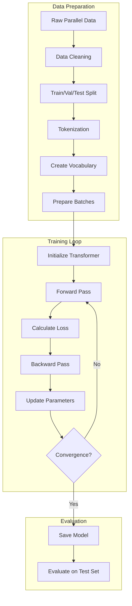
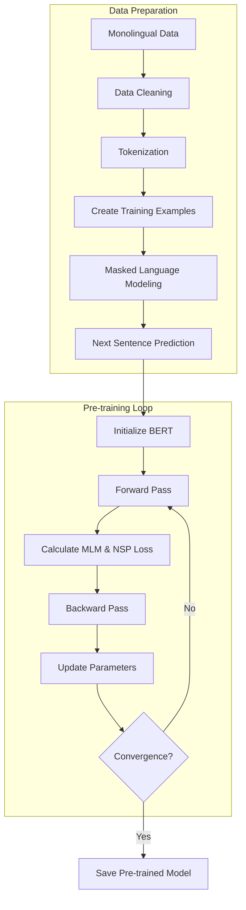
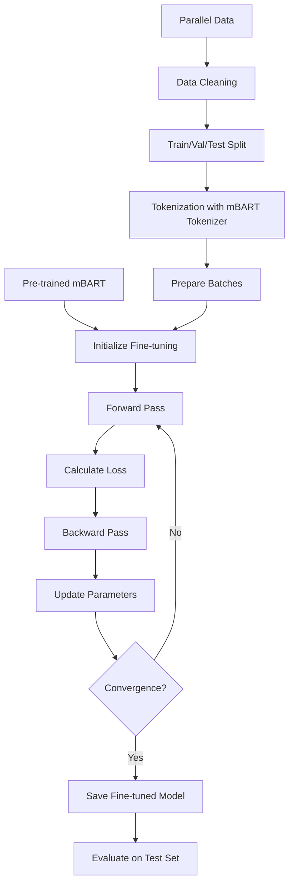
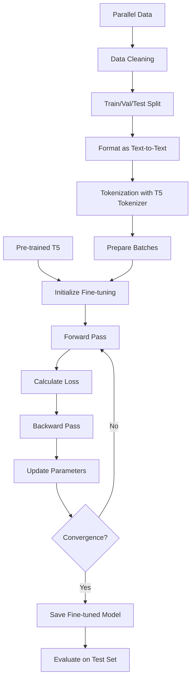
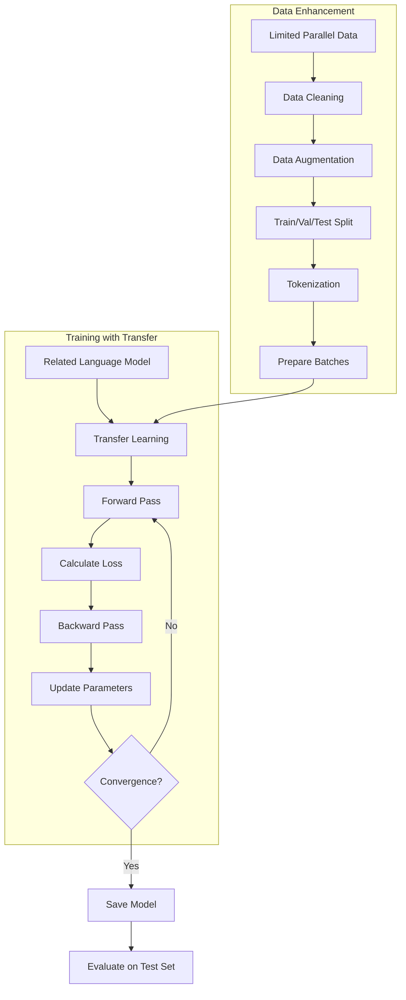

# Transformer and NMT Model Training Pipelines

This document provides visual explanations of training pipelines for various neural machine translation models, with a focus on transformer architectures.

## Table of Contents
- [Transformer Training Pipeline](#transformer-training-pipeline)
- [BERT Pre-training Pipeline](#bert-pre-training-pipeline)
- [mBART Fine-tuning Pipeline](#mbart-fine-tuning-pipeline)
- [T5 Training Pipeline](#t5-training-pipeline)
- [Low-Resource NMT Pipeline](#low-resource-nmt-pipeline)

## Transformer Training Pipeline

### Key Components

1. **Data Preparation**:
   - Clean and normalize text
   - Split into train/validation/test sets
   - Train tokenizers (SentencePiece or Hugging Face)
   - Build vocabulary for source and target languages

2. **Transformer Architecture**:
   - Encoder: Self-attention + Feed-forward
   - Decoder: Self-attention + Cross-attention + Feed-forward
   - Multi-head attention mechanism
   - Positional encoding

3. **Training Process**:
   - Teacher forcing (using ground truth as input)
   - Label smoothing regularization
   - Learning rate scheduling with warmup
   - Gradient clipping

## BERT Pre-training Pipeline

## mBART Fine-tuning Pipeline

## T5 Training Pipeline

## Low-Resource NMT Pipeline

### Key Techniques for Low-Resource Languages

1. **Data Augmentation**:
   - Back-translation
   - Data synthesis
   - Paraphrasing

2. **Transfer Learning**:
   - From related high-resource languages
   - From multilingual pre-trained models

3. **Regularization**:
   - Stronger dropout
   - Label smoothing
   - Early stopping

4. **Architecture Modifications**:
   - Shared encoders
   - Adapter modules
   - Smaller model variants