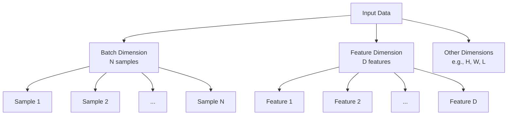
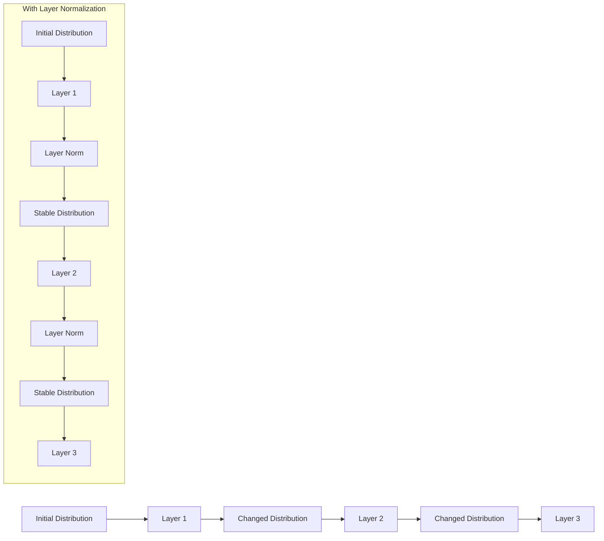
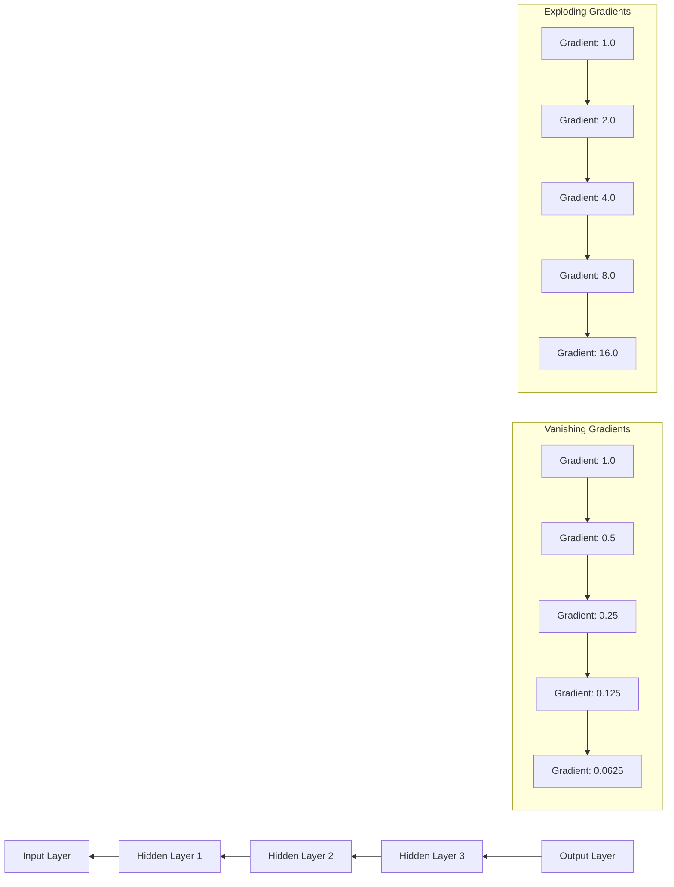
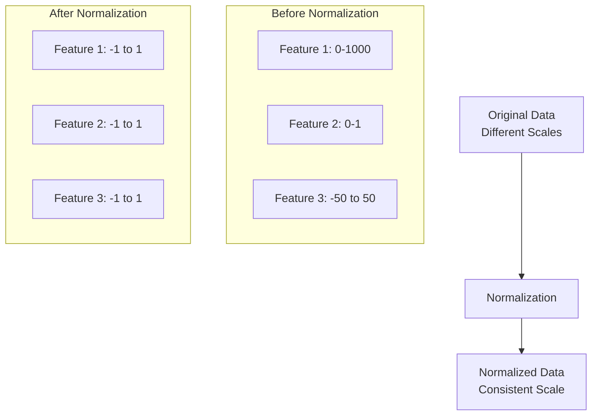

# Module 1.0: Fundamental Concepts for Understanding Layer Normalization

Before diving into the mathematical foundations of Layer Normalization, let's clarify some fundamental concepts that are essential for understanding why normalization techniques are needed and how they work.

## 1.0.1 Basic Terminology

### What is a Sample?

In machine learning, a **sample** refers to a single data point or example in your dataset:

- In image classification, a sample is one image
- In natural language processing, a sample might be one sentence or document
- In time series analysis, a sample might be one sequence of measurements

When we process data in neural networks, we typically work with batches of samples (multiple examples at once).

### What are Features?

**Features** are the individual measurable properties or characteristics of the phenomena being observed:

- In image processing, features might be pixel values
- In NLP, features might be word embeddings
- In a tabular dataset, features are the columns of the table

The **feature dimension** refers to the axis or dimension in your data that represents these different features.

### Dimensions in Neural Networks

Let's clarify the common dimensions in neural network data:

- **Batch dimension**: Represents multiple samples processed together (often denoted as N)
- **Feature dimension**: Represents the different features or attributes (often denoted as D, F, or C for channels)
- **Spatial dimensions**: For images or spatial data (height H and width W)
- **Sequence dimension**: For sequential data like text (sequence length L)

For example, in a batch of images, the data might have shape (N, C, H, W) where:
- N = number of images in the batch
- C = number of channels (e.g., 3 for RGB)
- H = height of the image
- W = width of the image

## 1.0.2 Training Challenges in Neural Networks

### What is Internal Covariate Shift?

**Internal covariate shift** refers to the change in the distribution of network activations due to the change in network parameters during training.

In simpler terms:
1. When we update the weights in a neural network during training
2. The distribution of inputs to subsequent layers changes
3. Each layer constantly has to adapt to a new input distribution
4. This slows down training because layers can't "settle" on a solution

Visual explanation:
```
Layer 1 → Layer 2 → Layer 3
   ↓         ↓         ↓
Updates    Input      Input
weights   distribution distribution
           changes    changes
```

This is like trying to hit a moving target - as you adjust your aim, the target keeps moving!

### What are Vanishing Gradients?

**Vanishing gradients** occur when the gradients (derivatives used to update weights) become extremely small as they propagate backward through the network during training.

Why this happens:
1. During backpropagation, gradients are multiplied together as they flow backward
2. If these values are small (less than 1), they get smaller and smaller with each multiplication
3. Eventually, gradients for early layers become nearly zero
4. This means early layers learn very slowly or not at all

Visual explanation:
```
Output Layer → Hidden Layer 3 → Hidden Layer 2 → Hidden Layer 1 → Input Layer
    Gradient      Gradient        Gradient        Gradient
      1.0           0.5             0.25            0.125
```

This is like trying to communicate a message through multiple people - by the time it reaches the last person, the message has become a whisper that can barely be heard.

### What are Exploding Gradients?

**Exploding gradients** are the opposite problem - gradients become extremely large during backpropagation.

Why this happens:
1. If weights or activations are large, gradients can grow exponentially
2. This leads to very large weight updates
3. The model can become unstable and fail to converge
4. You might see NaN (Not a Number) values in your model

Visual explanation:
```
Output Layer → Hidden Layer 3 → Hidden Layer 2 → Hidden Layer 1 → Input Layer
    Gradient      Gradient        Gradient        Gradient
      2.0           4.0             8.0             16.0
```

This is like a small rumor that gets wildly exaggerated as it passes through a chain of people.

### What is Convergence?

**Convergence** refers to the process of a neural network reaching a state where its performance stops improving significantly with additional training.

In technical terms:
1. The loss function reaches a minimum (or close to it)
2. Weight updates become very small
3. The model's predictions stabilize

A model that converges quickly reaches good performance in fewer training iterations.

## 1.0.3 Understanding Normalization

### Why Normalize Data?

Normalization helps address the challenges mentioned above by:

1. **Stabilizing the distribution** of inputs to each layer
2. **Reducing internal covariate shift**
3. **Helping gradients flow** more effectively through the network
4. **Allowing higher learning rates**, which speeds up training
5. **Making the model less sensitive** to the scale of input features

### What Does Normalization Do?

At its core, normalization:

1. Shifts the data to have a specific mean (usually 0)
2. Scales the data to have a specific variance (usually 1)

This creates a more consistent and well-behaved distribution that's easier for neural networks to work with.

### Why Divide by Variance?

When we normalize data, we:
1. Subtract the mean (to center the data around zero)
2. Divide by the standard deviation (square root of variance)

The division by standard deviation is crucial because:
1. It scales the data to have unit variance
2. This makes the scale of different features comparable
3. It prevents features with large magnitudes from dominating the learning process

Think of it like this: if one feature ranges from 0-1000 and another from 0-1, the first feature would have a much larger impact on the model without normalization.

## 1.0.4 Input Vector and Feature Dimensions

### What is an Input Vector?

An **input vector** is simply a collection of values that are fed into a neural network or a specific layer:

- For the first layer, it's the raw input features
- For hidden layers, it's the output from the previous layer

In the context of Layer Normalization, the input vector refers to the values that will be normalized.

### Understanding Feature Dimensions

The **feature dimension** is the dimension along which different features or attributes are represented:

- In a simple feedforward network, it's typically the last dimension of the input tensor
- In a CNN, it might be the channel dimension
- In an RNN or Transformer, it could be the hidden state dimension

Layer Normalization specifically normalizes across this feature dimension, treating each sample independently.

### Visualizing Dimensions in Different Network Types

**Feedforward Network:**
```
Input shape: (batch_size, features)
Normalize across: features dimension
```

**Convolutional Network:**
```
Input shape: (batch_size, channels, height, width)
Normalize across: channels, height, and width dimensions together
```

**Recurrent Network:**
```
Input shape: (batch_size, sequence_length, hidden_size)
Normalize across: hidden_size dimension
```

## 1.0.5 How Gradients Flow

### What are Gradients?

**Gradients** are derivatives that indicate how a change in a parameter (like a weight) affects the loss function. They determine the direction and magnitude of weight updates during training.

### Gradient Flow in Neural Networks

Gradient flow refers to how these derivatives propagate backward through the network during training:

1. **Forward pass**: Input data passes through the network to produce an output
2. **Loss calculation**: The difference between the output and the target is measured
3. **Backward pass**: Gradients of the loss with respect to each parameter are calculated
4. **Parameter update**: Weights are adjusted based on these gradients

### How Normalization Affects Gradient Flow

Normalization techniques like Layer Normalization improve gradient flow by:

1. **Preventing extreme values**: Keeping activations in a reasonable range prevents vanishing/exploding gradients
2. **Decorrelating features**: Making features more independent helps gradients flow more directly
3. **Stabilizing the optimization landscape**: Creating a smoother loss surface that's easier to optimize

Visual representation of gradient flow with and without normalization:

```
Without Normalization:
Layer 1 → Layer 2 → Layer 3 → Output
   ↑         ↑         ↑        ↑
Unstable   Unstable   Unstable  Loss
gradients  gradients  gradients

With Normalization:
Layer 1 → Norm → Layer 2 → Norm → Layer 3 → Norm → Output
   ↑                ↑                ↑               ↑
Stable           Stable           Stable          Loss
gradients        gradients        gradients
```

## Summary

In this module, we've covered the fundamental concepts needed to understand Layer Normalization:

1. **Basic terminology**: Samples, features, and dimensions in neural networks
2. **Training challenges**: Internal covariate shift, vanishing/exploding gradients, and convergence
3. **Normalization basics**: Why we normalize data and how it works
4. **Input vectors and feature dimensions**: Understanding what we're normalizing
5. **Gradient flow**: How derivatives propagate through the network and how normalization helps

With these concepts clarified, we're now ready to dive into the mathematical foundations of Layer Normalization in the next module.

## Visual Aids

### Data Dimensions Visualization




### Internal Covariate Shift Visualization




### Vanishing vs. Exploding Gradients




### Normalization Effect




