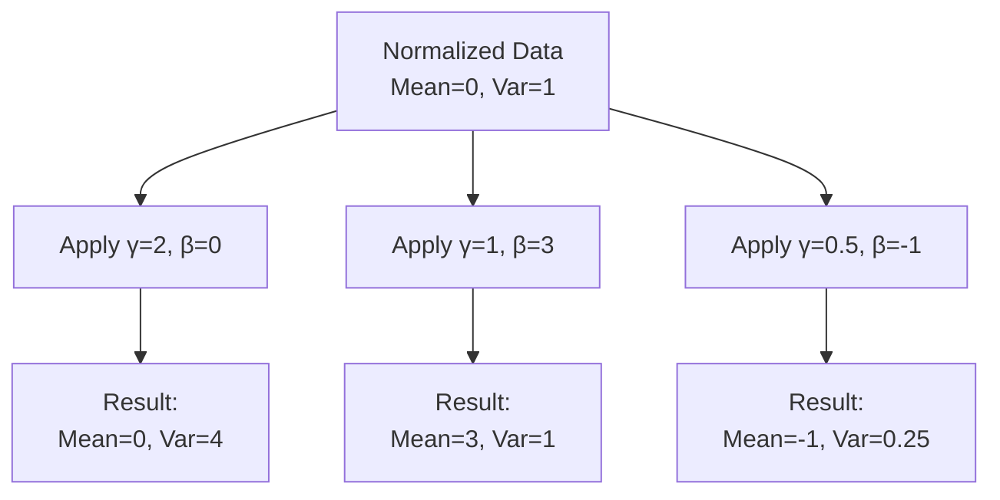

# Module 1.5: Layer Normalization Formula - Detailed Explanation

This module provides an in-depth explanation of the Layer Normalization formula, breaking down each component and explaining the reasoning behind the mathematical operations.

## 1.5.1 The Layer Normalization Formula

The Layer Normalization formula is:

$$y = \frac{x - \mu}{\sqrt{\sigma^2 + \epsilon}} \cdot \gamma + \beta$$

Let's break down each component in detail:

## 1.5.2 Input Vector (x) - What Exactly Are We Normalizing?

The input vector $x$ represents the values that we want to normalize. In a neural network, this could be:

### What is x in Different Contexts?

1. **In a Feedforward Layer**: 
   - $x$ is the result of the linear transformation $x = Wh + b$ 
   - Shape: (batch_size, features)
   - Each row represents one sample, each column represents one feature

2. **In a Recurrent Layer**:
   - $x$ might be the hidden state $h_t$
   - Shape: (batch_size, hidden_size)
   - Each row is one sample's hidden state

3. **In a Transformer**:
   - $x$ could be the output of self-attention or the feedforward network
   - Shape: (batch_size, sequence_length, hidden_size)
   - We normalize along the hidden_size dimension

### Concrete Example

Let's consider a simple case with a batch of 2 samples, each with 4 features:

```
x = [
    [1.0, 2.0, 3.0, 4.0],  # Sample 1
    [5.0, 6.0, 7.0, 8.0]   # Sample 2
]
```

In Layer Normalization, we normalize each sample independently across its features.

## 1.5.3 Mean (μ) - Centering the Data

The mean $\mu$ is calculated for each sample across its features:

$$\mu = \frac{1}{H} \sum_{i=1}^{H} x_i$$

Where:
- $H$ is the number of features (or hidden units)
- $x_i$ is the value of the i-th feature

### Why Calculate the Mean?

We calculate the mean to center the data around zero. This is important because:

1. **Centered data is easier to normalize**: It makes the variance calculation more straightforward
2. **Zero-centered data works better with many activation functions**: Functions like tanh and sigmoid are centered around zero
3. **It removes the absolute scale**: We care about the relative values, not the absolute scale

### Concrete Example

For our example:

```
Sample 1: μ = (1.0 + 2.0 + 3.0 + 4.0) / 4 = 2.5
Sample 2: μ = (5.0 + 6.0 + 7.0 + 8.0) / 4 = 6.5
```

So our means are:
```
μ = [
    [2.5],  # Mean for Sample 1
    [6.5]   # Mean for Sample 2
]
```

## 1.5.4 Variance (σ²) - Measuring Spread

The variance $\sigma^2$ is calculated for each sample across its features:

$$\sigma^2 = \frac{1}{H} \sum_{i=1}^{H} (x_i - \mu)^2$$

Where:
- $H$ is the number of features
- $x_i - \mu$ is the deviation of each feature from the mean

### Why Calculate the Variance?

Variance measures how spread out the values are from the mean. We need this because:

1. **It quantifies the scale of the data**: Higher variance means more spread out values
2. **It allows us to standardize**: By dividing by the square root of variance, we can standardize the data
3. **It helps with gradient flow**: Properly scaled activations help prevent vanishing/exploding gradients

### Concrete Example

For our example:

```
Sample 1: 
σ² = ((1.0-2.5)² + (2.0-2.5)² + (3.0-2.5)² + (4.0-2.5)²) / 4
   = ((-1.5)² + (-0.5)² + (0.5)² + (1.5)²) / 4
   = (2.25 + 0.25 + 0.25 + 2.25) / 4
   = 5.0 / 4
   = 1.25

Sample 2:
σ² = ((5.0-6.5)² + (6.0-6.5)² + (7.0-6.5)² + (8.0-6.5)²) / 4
   = ((-1.5)² + (-0.5)² + (0.5)² + (1.5)²) / 4
   = (2.25 + 0.25 + 0.25 + 2.25) / 4
   = 5.0 / 4
   = 1.25
```

So our variances are:
```
σ² = [
    [1.25],  # Variance for Sample 1
    [1.25]   # Variance for Sample 2
]
```

## 1.5.5 Why Divide by the Square Root of Variance?

In the formula, we divide by $\sqrt{\sigma^2 + \epsilon}$. Let's understand why:

### The Purpose of Division by Standard Deviation

1. **Standardization**: This operation standardizes the data to have unit variance. After this step, the data will have a standard deviation of approximately 1.

2. **Scale Invariance**: This makes the network invariant to the scale of the inputs. Whether your features range from 0-1 or 0-1000, they'll be normalized to a similar scale.

3. **Balanced Gradient Flow**: Features with different scales would otherwise have different impacts on the gradient. Standardization ensures all features contribute more equally.

### Why Square Root?

We use the square root of variance (which is the standard deviation) because:

1. **Unit Matching**: Variance is in squared units, so we take the square root to get back to the original units
2. **Statistical Standardization**: In statistics, standardization involves dividing by the standard deviation, not variance
3. **Gradient Stability**: Dividing by standard deviation provides better numerical properties for gradient flow

### Concrete Example

For our example:
```
Sample 1: 
√(σ² + ε) = √(1.25 + 1e-5) ≈ 1.118

Sample 2:
√(σ² + ε) = √(1.25 + 1e-5) ≈ 1.118
```

## 1.5.6 Numerical Stability Constant (ε) - Preventing Division by Zero

The small constant $\epsilon$ (typically set to values like 1e-5 or 1e-8) is added to the variance before taking the square root.

### Why Add a Small Constant?

1. **Preventing Division by Zero**: If the variance is zero (all values in the input are identical), division would result in infinity or NaN
2. **Numerical Stability**: Even with very small variances, division can lead to extremely large values that cause instability
3. **Gradient Stability**: During backpropagation, gradients flow through this division operation, and $\epsilon$ helps keep gradients stable

### When is Variance Zero or Very Small?

Variance can be zero or very small in several scenarios:
- All input values are identical
- The network has converged to a state where activations are very similar
- Early in training when weights are initialized to similar values
- In certain layers or neurons that have become "dead" during training

### Concrete Example

If all values in a sample were identical:
```
x = [
    [3.0, 3.0, 3.0, 3.0]  # All values are 3.0
]
```

Then:
```
μ = 3.0
σ² = 0.0  # All values equal the mean, so variance is zero

Without ε: 
x_norm = (x - μ) / √(σ²) = (3.0 - 3.0) / √0 = 0 / 0 = undefined

With ε = 1e-5:
x_norm = (x - μ) / √(σ² + ε) = (3.0 - 3.0) / √(0 + 1e-5) = 0 / 0.00316 = 0
```

## 1.5.7 Normalization Step - Putting It Together

The normalization step combines the operations we've discussed:

$$\hat{x} = \frac{x - \mu}{\sqrt{\sigma^2 + \epsilon}}$$

This operation:
1. Centers the data by subtracting the mean
2. Scales the data to have approximately unit variance by dividing by the standard deviation

### Concrete Example

For our original example:
```
x = [
    [1.0, 2.0, 3.0, 4.0],  # Sample 1
    [5.0, 6.0, 7.0, 8.0]   # Sample 2
]

μ = [
    [2.5],  # Mean for Sample 1
    [6.5]   # Mean for Sample 2
]

√(σ² + ε) ≈ [
    [1.118],  # Standard deviation for Sample 1
    [1.118]   # Standard deviation for Sample 2
]

x̂ = (x - μ) / √(σ² + ε)

Sample 1:
x̂ = [(1.0-2.5)/1.118, (2.0-2.5)/1.118, (3.0-2.5)/1.118, (4.0-2.5)/1.118]
  = [-1.34, -0.45, 0.45, 1.34]

Sample 2:
x̂ = [(5.0-6.5)/1.118, (6.0-6.5)/1.118, (7.0-6.5)/1.118, (8.0-6.5)/1.118]
  = [-1.34, -0.45, 0.45, 1.34]
```

After normalization, both samples have similar distributions despite having different original scales.

## 1.5.8 Scale (γ) and Shift (β) Parameters - Restoring Representational Power

The final step in Layer Normalization is applying the learnable scale $\gamma$ and shift $\beta$ parameters:

$$y = \gamma \cdot \hat{x} + \beta$$

### What are γ and β?

- **γ (gamma)**: A learnable parameter that scales the normalized values
- **β (beta)**: A learnable parameter that shifts the normalized values

Both parameters have the same shape as the feature dimension.

### Why Do We Need γ and β?

1. **Restoring Representational Power**: Normalization constrains the data to have zero mean and unit variance, which might limit what the network can represent. γ and β allow the network to undo this constraint if needed.

2. **Learning Optimal Distributions**: Different layers might benefit from different distributions. These parameters allow each layer to learn its optimal distribution.

3. **Feature-Specific Scaling**: Each feature can have its own scale and shift, allowing the network to emphasize or de-emphasize certain features.

4. **Identity Transformation**: With appropriate values of γ and β, the layer can learn to perform an identity transformation, effectively "turning off" the normalization if it's not beneficial.

### Initialization of γ and β

- **γ is typically initialized to 1**: This starts with the normalized distribution
- **β is typically initialized to 0**: This maintains the zero mean initially

### Concrete Example

If we initialize γ = [1.0, 1.0, 1.0, 1.0] and β = [0.0, 0.0, 0.0, 0.0]:

```
y = γ · x̂ + β

Sample 1:
y = [1.0*(-1.34)+0.0, 1.0*(-0.45)+0.0, 1.0*(0.45)+0.0, 1.0*(1.34)+0.0]
  = [-1.34, -0.45, 0.45, 1.34]

Sample 2:
y = [1.0*(-1.34)+0.0, 1.0*(-0.45)+0.0, 1.0*(0.45)+0.0, 1.0*(1.34)+0.0]
  = [-1.34, -0.45, 0.45, 1.34]
```

But during training, γ and β will be updated to learn the optimal distribution for each feature.

## 1.5.9 How Gradients Flow Through Layer Normalization

Understanding how gradients flow through Layer Normalization is crucial for understanding why it helps with training.

### Forward Pass

During the forward pass, data flows through Layer Normalization as we've described:
1. Calculate mean and variance
2. Normalize the data
3. Apply scale and shift

### Backward Pass

During the backward pass, gradients flow backward through these operations:

1. **Gradients through γ and β**:
   - $\frac{\partial L}{\partial \gamma} = \sum_i \frac{\partial L}{\partial y_i} \cdot \hat{x}_i$
   - $\frac{\partial L}{\partial \beta} = \sum_i \frac{\partial L}{\partial y_i}$

2. **Gradients through normalization**:
   - This is more complex due to the dependencies between inputs in the mean and variance calculations
   - The key insight is that the gradient is "smoothed" across all features, preventing any single feature from having an outsized impact

### Why This Helps with Training

1. **Gradient Magnitude Control**: Layer Normalization helps control the magnitude of gradients, preventing them from becoming too large or too small

2. **Decorrelation of Features**: By normalizing across features, Layer Normalization reduces the correlation between features, which can lead to more efficient learning

3. **Smoother Optimization Landscape**: Normalization creates a smoother loss landscape that's easier to optimize with gradient-based methods

## 1.5.10 Putting It All Together - The Complete Formula

Let's revisit the complete Layer Normalization formula:

$$y = \frac{x - \mu}{\sqrt{\sigma^2 + \epsilon}} \cdot \gamma + \beta$$

Where:
- $x$ is the input vector (activations for one sample)
- $\mu$ is the mean calculated across the feature dimension
- $\sigma^2$ is the variance calculated across the feature dimension
- $\epsilon$ is a small constant for numerical stability
- $\gamma$ and $\beta$ are learnable parameters for scaling and shifting

This formula:
1. Centers the data by subtracting the mean
2. Scales the data to have unit variance by dividing by the standard deviation
3. Applies learnable scaling and shifting to restore representational power

## Summary

In this module, we've provided a detailed explanation of the Layer Normalization formula:

1. **Input Vector (x)**: The activations we want to normalize
2. **Mean (μ)**: Centers the data around zero
3. **Variance (σ²)**: Measures the spread of the data
4. **Division by Standard Deviation**: Standardizes the data to have unit variance
5. **Numerical Stability Constant (ε)**: Prevents division by zero and stabilizes gradients
6. **Scale (γ) and Shift (β) Parameters**: Restore representational power and allow learning optimal distributions
7. **Gradient Flow**: How derivatives propagate through the normalization operation

Understanding these components in detail helps clarify why Layer Normalization is effective in improving neural network training.

## Visual Aids

### Layer Normalization Process

```mermaid
graph LR
    A[Input x] --> B[Calculate Mean μ]
    A --> C[Calculate Variance σ²]
    B --> D[Subtract Mean<br>x - μ]
    C --> E[Add ε<br>σ² + ε]
    E --> F[Take Square Root<br>√(σ² + ε)]
    D --> G[Divide<br>(x - μ) / √(σ² + ε)]
    F --> G
    G --> H[Scale<br>γ · x̂]
    H --> I[Shift<br>γ · x̂ + β]
    I --> J[Output y]
```


### Effect of γ and β on Normalized Data




