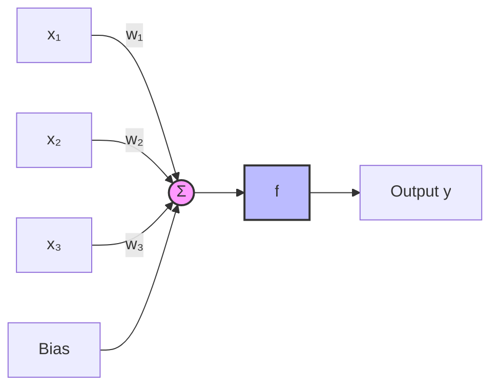
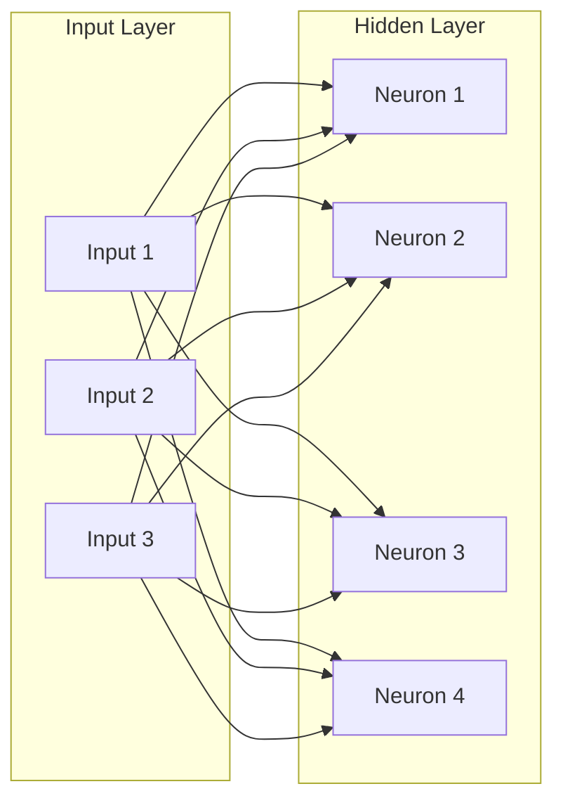
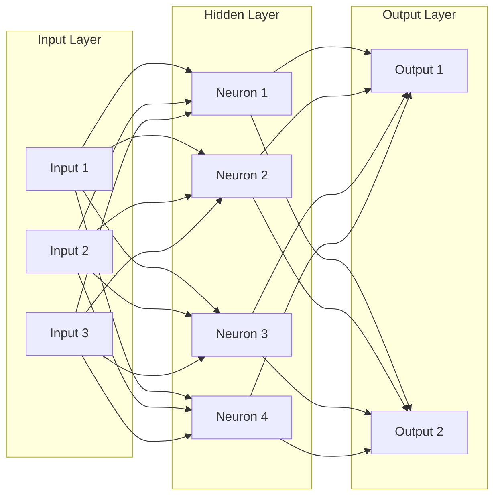
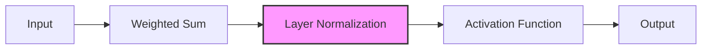

# Module 2.1: Neural Network Architecture

This module introduces the fundamental building blocks of neural networks, focusing on the architecture components that are relevant to understanding Layer Normalization.

## 2.1.1 Neurons: The Basic Building Blocks

A neuron is the fundamental unit of a neural network, inspired by biological neurons in the brain. It takes multiple inputs, applies weights, adds a bias, and passes the result through an activation function.

### Mathematical Representation

The output of a neuron can be represented as:

$$y = f\left(\sum_{i=1}^{n} w_i x_i + b\right)$$

Where:
- $x_i$ are the inputs
- $w_i$ are the weights
- $b$ is the bias
- $f$ is the activation function
- $y$ is the output

### Code Implementation

```python
import numpy as np

class Neuron:
    def __init__(self, num_inputs):
        # Initialize weights and bias
        self.weights = np.random.randn(num_inputs) * 0.01
        self.bias = 0
        
    def forward(self, inputs, activation_fn):
        """
        Forward pass through the neuron
        
        Args:
            inputs: Input values
            activation_fn: Activation function to apply
            
        Returns:
            Output of the neuron
        """
        # Calculate weighted sum
        weighted_sum = np.dot(inputs, self.weights) + self.bias
        
        # Apply activation function
        output = activation_fn(weighted_sum)
        
        return output

# Example usage
def relu(x):
    return np.maximum(0, x)

# Create a neuron with 3 inputs
neuron = Neuron(3)

# Sample input
inputs = np.array([0.5, -0.2, 0.1])

# Forward pass
output = neuron.forward(inputs, relu)
print(f"Neuron output: {output}")
```

### Visualization of a Neuron




## 2.1.2 Layers: Organizing Neurons

Neural networks are organized into layers, with each layer containing multiple neurons. The three main types of layers are:

1. **Input Layer**: Receives the raw data
2. **Hidden Layers**: Intermediate layers that transform the data
3. **Output Layer**: Produces the final prediction

### Fully Connected (Dense) Layer

A fully connected layer connects every neuron in one layer to every neuron in the next layer.

```python
import numpy as np

class DenseLayer:
    def __init__(self, input_size, output_size):
        # Initialize weights and biases
        self.weights = np.random.randn(input_size, output_size) * 0.01
        self.biases = np.zeros(output_size)
        
    def forward(self, inputs, activation_fn):
        """
        Forward pass through the layer
        
        Args:
            inputs: Input values of shape (batch_size, input_size)
            activation_fn: Activation function to apply
            
        Returns:
            Output of the layer of shape (batch_size, output_size)
        """
        # Calculate weighted sum
        weighted_sum = np.dot(inputs, self.weights) + self.biases
        
        # Apply activation function
        output = activation_fn(weighted_sum)
        
        return output

# Example usage
def sigmoid(x):
    return 1 / (1 + np.exp(-x))

# Create a layer with 4 inputs and 3 outputs
layer = DenseLayer(4, 3)

# Sample batch of 2 inputs
inputs = np.array([
    [0.5, -0.2, 0.1, 0.8],
    [0.1, 0.3, -0.5, 0.2]
])

# Forward pass
output = layer.forward(inputs, sigmoid)
print(f"Layer output shape: {output.shape}")
print(f"Layer output:\n{output}")
```

### Visualization of a Fully Connected Layer




## 2.1.3 Activation Functions

Activation functions introduce non-linearity into neural networks, allowing them to learn complex patterns. Here are some common activation functions:

### ReLU (Rectified Linear Unit)

$$f(x) = \max(0, x)$$

```python
def relu(x):
    return np.maximum(0, x)
```

### Sigmoid

$$f(x) = \frac{1}{1 + e^{-x}}$$

```python
def sigmoid(x):
    return 1 / (1 + np.exp(-x))
```

### Tanh (Hyperbolic Tangent)

$$f(x) = \frac{e^x - e^{-x}}{e^x + e^{-x}}$$

```python
def tanh(x):
    return np.tanh(x)
```

### Visualization of Activation Functions

```python
import numpy as np
import matplotlib.pyplot as plt

# Define activation functions
def relu(x):
    return np.maximum(0, x)

def sigmoid(x):
    return 1 / (1 + np.exp(-x))

def tanh(x):
    return np.tanh(x)

# Create x values
x = np.linspace(-5, 5, 100)

# Calculate activation function outputs
y_relu = relu(x)
y_sigmoid = sigmoid(x)
y_tanh = tanh(x)

# Plot activation functions
plt.figure(figsize=(12, 6))
plt.plot(x, y_relu, label='ReLU', color='blue')
plt.plot(x, y_sigmoid, label='Sigmoid', color='red')
plt.plot(x, y_tanh, label='Tanh', color='green')
plt.axhline(y=0, color='k', linestyle='-', alpha=0.3)
plt.axvline(x=0, color='k', linestyle='-', alpha=0.3)
plt.grid(alpha=0.3)
plt.title('Activation Functions')
plt.xlabel('x')
plt.ylabel('f(x)')
plt.legend()
plt.savefig('activation_functions.png')
plt.close()
```


## 2.1.4 Neural Network Architecture

A complete neural network combines multiple layers of neurons. Here's a simple implementation of a feedforward neural network:

```python
import numpy as np

class NeuralNetwork:
    def __init__(self, layer_sizes):
        """
        Initialize a neural network
        
        Args:
            layer_sizes: List of integers representing the number of neurons in each layer
                         (including input and output layers)
        """
        self.num_layers = len(layer_sizes)
        self.layer_sizes = layer_sizes
        self.weights = []
        self.biases = []
        
        # Initialize weights and biases for each layer
        for i in range(1, self.num_layers):
            # Initialize weights with small random values
            w = np.random.randn(layer_sizes[i-1], layer_sizes[i]) * 0.01
            self.weights.append(w)
            
            # Initialize biases with zeros
            b = np.zeros((1, layer_sizes[i]))
            self.biases.append(b)
    
    def forward(self, x, activation_fn):
        """
        Forward pass through the network
        
        Args:
            x: Input data of shape (batch_size, input_size)
            activation_fn: Activation function to apply
            
        Returns:
            Output of the network
        """
        # Input layer
        activation = x
        
        # Hidden layers and output layer
        for i in range(self.num_layers - 1):
            z = np.dot(activation, self.weights[i]) + self.biases[i]
            activation = activation_fn(z)
        
        return activation

# Example usage
def sigmoid(x):
    return 1 / (1 + np.exp(-x))

# Create a neural network with architecture [3, 4, 2]
# (3 input neurons, 4 hidden neurons, 2 output neurons)
nn = NeuralNetwork([3, 4, 2])

# Sample input
x = np.array([[0.1, 0.2, 0.3]])

# Forward pass
output = nn.forward(x, sigmoid)
print(f"Neural network output: {output}")
```

### Visualization of a Neural Network




## 2.1.5 Where Layer Normalization Fits

Layer Normalization is typically applied after the weighted sum but before the activation function:

$$z = \sum_{i=1}^{n} w_i x_i + b$$
$$z_{norm} = \text{LayerNorm}(z)$$
$$a = f(z_{norm})$$

This helps stabilize the distribution of inputs to the activation function, which can improve training dynamics.

### Visualization of Layer Normalization in a Neural Network




## Summary

In this module, we've covered the fundamental building blocks of neural networks:

1. **Neurons**: The basic computational units
2. **Layers**: Collections of neurons
3. **Activation Functions**: Non-linear transformations
4. **Neural Network Architecture**: How neurons and layers are organized
5. **Layer Normalization Placement**: Where normalization fits in the architecture

In the next module, we'll explore forward and backward propagation, which are essential for understanding how neural networks learn.

## Practice Exercises

1. Implement a simple neural network with one hidden layer and apply layer normalization before the activation function.
2. Visualize the distribution of activations before and after layer normalization.
3. Experiment with different activation functions and observe how they interact with layer normalization.
4. Implement a neural network class that allows for optional layer normalization after each layer.
