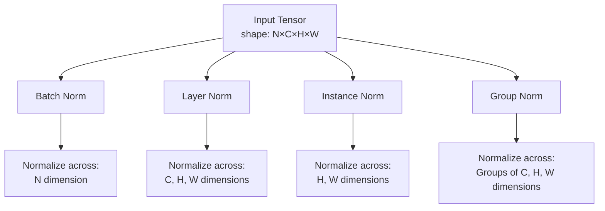

# Module 3.1: Normalization Techniques Overview

This module provides an overview of different normalization techniques used in deep learning, setting the stage for a deeper understanding of Layer Normalization.

## 3.1.1 The Need for Normalization

Normalization techniques have become essential components of modern deep neural networks for several reasons:

1. **Accelerating Training**: Normalization can significantly speed up the training process by allowing higher learning rates and reducing the number of iterations needed for convergence.

2. **Stabilizing Training**: By controlling the distribution of layer inputs, normalization helps prevent issues like vanishing and exploding gradients.

3. **Reducing Internal Covariate Shift**: Normalization techniques minimize the change in the distribution of network activations during training.

4. **Regularization Effect**: Many normalization methods have a regularizing effect, improving generalization performance.

## 3.1.2 Types of Normalization

There are several types of normalization techniques, each with its own approach to normalizing activations:

### Input Normalization

The most basic form of normalization is applied to the input data before feeding it into the network.

```python
def input_normalization(X):
    """
    Normalize input data to have zero mean and unit variance
    
    Args:
        X: Input data of shape (n_samples, n_features)
        
    Returns:
        Normalized data of same shape
    """
    mean = np.mean(X, axis=0)
    std = np.std(X, axis=0)
    return (X - mean) / std
```

### Batch Normalization

Batch Normalization normalizes the activations across the batch dimension. It was introduced by Sergey Ioffe and Christian Szegedy in 2015.

**Formula:**
$$\text{BN}(x) = \gamma \cdot \frac{x - \mu_B}{\sqrt{\sigma_B^2 + \epsilon}} + \beta$$

Where:
- $\mu_B$ is the mean computed over the batch dimension
- $\sigma_B^2$ is the variance computed over the batch dimension
- $\gamma$ and $\beta$ are learnable parameters
- $\epsilon$ is a small constant for numerical stability

```python
def batch_norm(x, gamma, beta, eps=1e-5):
    """
    Apply batch normalization
    
    Args:
        x: Input data of shape (batch_size, features)
        gamma: Scale parameter of shape (features,)
        beta: Shift parameter of shape (features,)
        eps: Small constant for numerical stability
        
    Returns:
        Normalized data of same shape as x
    """
    # Calculate mean and variance along the batch dimension
    batch_mean = np.mean(x, axis=0)
    batch_var = np.var(x, axis=0)
    
    # Normalize
    x_norm = (x - batch_mean) / np.sqrt(batch_var + eps)
    
    # Scale and shift
    return gamma * x_norm + beta
```

### Layer Normalization

Layer Normalization normalizes the activations across the feature dimension for each sample independently. It was introduced by Jimmy Lei Ba et al. in 2016.

**Formula:**
$$\text{LN}(x) = \gamma \cdot \frac{x - \mu_L}{\sqrt{\sigma_L^2 + \epsilon}} + \beta$$

Where:
- $\mu_L$ is the mean computed over the feature dimension
- $\sigma_L^2$ is the variance computed over the feature dimension
- $\gamma$ and $\beta$ are learnable parameters
- $\epsilon$ is a small constant for numerical stability

```python
def layer_norm(x, gamma, beta, eps=1e-5):
    """
    Apply layer normalization
    
    Args:
        x: Input data of shape (batch_size, features)
        gamma: Scale parameter of shape (features,)
        beta: Shift parameter of shape (features,)
        eps: Small constant for numerical stability
        
    Returns:
        Normalized data of same shape as x
    """
    # Calculate mean and variance along the feature dimension
    layer_mean = np.mean(x, axis=1, keepdims=True)
    layer_var = np.var(x, axis=1, keepdims=True)
    
    # Normalize
    x_norm = (x - layer_mean) / np.sqrt(layer_var + eps)
    
    # Scale and shift
    return gamma * x_norm + beta
```

### Instance Normalization

Instance Normalization normalizes each feature map independently for each sample. It's commonly used in style transfer and generative models.

**Formula:**
$$\text{IN}(x) = \gamma \cdot \frac{x - \mu_I}{\sqrt{\sigma_I^2 + \epsilon}} + \beta$$

Where:
- $\mu_I$ is the mean computed over the spatial dimensions (height and width) for each channel and each sample
- $\sigma_I^2$ is the variance computed over the spatial dimensions for each channel and each sample
- $\gamma$ and $\beta$ are learnable parameters
- $\epsilon$ is a small constant for numerical stability

```python
def instance_norm(x, gamma, beta, eps=1e-5):
    """
    Apply instance normalization
    
    Args:
        x: Input data of shape (batch_size, channels, height, width)
        gamma: Scale parameter of shape (channels,)
        beta: Shift parameter of shape (channels,)
        eps: Small constant for numerical stability
        
    Returns:
        Normalized data of same shape as x
    """
    # Calculate mean and variance along the spatial dimensions
    # for each channel and each sample
    axes = (2, 3)  # Height and width dimensions
    instance_mean = np.mean(x, axis=axes, keepdims=True)
    instance_var = np.var(x, axis=axes, keepdims=True)
    
    # Normalize
    x_norm = (x - instance_mean) / np.sqrt(instance_var + eps)
    
    # Scale and shift (broadcasting gamma and beta)
    gamma = gamma.reshape(1, -1, 1, 1)
    beta = beta.reshape(1, -1, 1, 1)
    
    return gamma * x_norm + beta
```

### Group Normalization

Group Normalization divides the channels into groups and normalizes the features within each group. It was introduced by Yuxin Wu and Kaiming He in 2018.

**Formula:**
$$\text{GN}(x) = \gamma \cdot \frac{x - \mu_G}{\sqrt{\sigma_G^2 + \epsilon}} + \beta$$

Where:
- $\mu_G$ is the mean computed over the spatial dimensions and channel groups for each sample
- $\sigma_G^2$ is the variance computed over the spatial dimensions and channel groups for each sample
- $\gamma$ and $\beta$ are learnable parameters
- $\epsilon$ is a small constant for numerical stability

```python
def group_norm(x, gamma, beta, G=32, eps=1e-5):
    """
    Apply group normalization
    
    Args:
        x: Input data of shape (batch_size, channels, height, width)
        gamma: Scale parameter of shape (channels,)
        beta: Shift parameter of shape (channels,)
        G: Number of groups
        eps: Small constant for numerical stability
        
    Returns:
        Normalized data of same shape as x
    """
    # Get dimensions
    N, C, H, W = x.shape
    
    # Reshape for grouping
    x = x.reshape(N, G, C // G, H, W)
    
    # Calculate mean and variance along the group, height, and width dimensions
    axes = (2, 3, 4)  # Channel subgroup, height, and width dimensions
    group_mean = np.mean(x, axis=axes, keepdims=True)
    group_var = np.var(x, axis=axes, keepdims=True)
    
    # Normalize
    x_norm = (x - group_mean) / np.sqrt(group_var + eps)
    
    # Reshape back
    x_norm = x_norm.reshape(N, C, H, W)
    
    # Scale and shift (broadcasting gamma and beta)
    gamma = gamma.reshape(1, -1, 1, 1)
    beta = beta.reshape(1, -1, 1, 1)
    
    return gamma * x_norm + beta
```

## 3.1.3 Comparison of Normalization Techniques

Each normalization technique has its strengths and weaknesses, making them suitable for different scenarios:

### Normalization Dimensions

The key difference between these techniques is the dimensions along which normalization is performed:




### Visualization of Different Normalization Techniques

```python
import numpy as np
import matplotlib.pyplot as plt

# Create sample data
batch_size = 2
channels = 3
height = 4
width = 4
x = np.random.randn(batch_size, channels, height, width)

# Apply different normalization techniques
# For simplicity, we'll use the same gamma and beta for all techniques
gamma = np.ones(channels)
beta = np.zeros(channels)

# Batch Normalization (normalize across batch dimension)
batch_mean = np.mean(x, axis=0, keepdims=True)
batch_var = np.var(x, axis=0, keepdims=True)
x_bn = (x - batch_mean) / np.sqrt(batch_var + 1e-5)

# Layer Normalization (normalize across channel, height, width dimensions)
x_reshaped = x.reshape(batch_size, -1)
layer_mean = np.mean(x_reshaped, axis=1, keepdims=True)
layer_var = np.var(x_reshaped, axis=1, keepdims=True)
x_ln = (x_reshaped - layer_mean) / np.sqrt(layer_var + 1e-5)
x_ln = x_ln.reshape(x.shape)

# Instance Normalization (normalize across height, width dimensions)
instance_mean = np.mean(x, axis=(2, 3), keepdims=True)
instance_var = np.var(x, axis=(2, 3), keepdims=True)
x_in = (x - instance_mean) / np.sqrt(instance_var + 1e-5)

# Group Normalization (normalize across groups of channels, height, width dimensions)
G = 1  # For simplicity, we'll use 1 group (equivalent to Layer Norm for C=3)
x_reshaped = x.reshape(batch_size, G, channels // G, height, width)
group_mean = np.mean(x_reshaped, axis=(2, 3, 4), keepdims=True)
group_var = np.var(x_reshaped, axis=(2, 3, 4), keepdims=True)
x_gn = (x_reshaped - group_mean) / np.sqrt(group_var + 1e-5)
x_gn = x_gn.reshape(x.shape)

# Visualize the first channel of the first sample
plt.figure(figsize=(15, 5))

plt.subplot(1, 5, 1)
plt.imshow(x[0, 0], cmap='viridis')
plt.title('Original')
plt.colorbar()

plt.subplot(1, 5, 2)
plt.imshow(x_bn[0, 0], cmap='viridis')
plt.title('Batch Norm')
plt.colorbar()

plt.subplot(1, 5, 3)
plt.imshow(x_ln[0, 0], cmap='viridis')
plt.title('Layer Norm')
plt.colorbar()

plt.subplot(1, 5, 4)
plt.imshow(x_in[0, 0], cmap='viridis')
plt.title('Instance Norm')
plt.colorbar()

plt.subplot(1, 5, 5)
plt.imshow(x_gn[0, 0], cmap='viridis')
plt.title('Group Norm')
plt.colorbar()

plt.tight_layout()
plt.savefig('normalization_comparison.png')
plt.close()
```


### Comparison Table

| Technique | Normalization Dimensions | Batch Size Dependency | Use Cases | Advantages | Limitations |
|-----------|--------------------------|----------------------|-----------|------------|-------------|
| Batch Normalization | Batch (N) | High | CNNs, Feedforward Networks | - Effective for CNNs<br>- Well-established<br>- Accelerates training | - Depends on batch size<br>- Different behavior during training and inference<br>- Less effective for RNNs |
| Layer Normalization | Features (C, H, W) | None | RNNs, Transformers | - Independent of batch size<br>- Same behavior during training and inference<br>- Works well with RNNs | - Less effective for CNNs<br>- Normalizes across all features |
| Instance Normalization | Spatial (H, W) | None | Style Transfer, GANs | - Removes style information<br>- Good for style transfer | - May remove useful feature information<br>- Limited applicability |
| Group Normalization | Group, Spatial (G, H, W) | None | CNNs with small batches | - Independent of batch size<br>- Compromise between Layer and Instance Norm | - Requires tuning of group size<br>- Additional hyperparameter |

## 3.1.4 When to Use Each Normalization Technique

Choosing the right normalization technique depends on the specific task and architecture:

### Batch Normalization

**Best for:**
- Convolutional Neural Networks (CNNs) with large batch sizes
- Feedforward networks
- When computational efficiency is important

**Not ideal for:**
- Very small batch sizes
- Recurrent Neural Networks (RNNs)
- When batch statistics vary significantly between training and inference

### Layer Normalization

**Best for:**
- Recurrent Neural Networks (RNNs)
- Transformer architectures
- When batch size is small or variable
- When consistent behavior between training and inference is important

**Not ideal for:**
- Some CNN architectures where channel-wise statistics are important

### Instance Normalization

**Best for:**
- Style transfer applications
- Generative Adversarial Networks (GANs)
- When removing style information is beneficial

**Not ideal for:**
- Tasks where style information is important
- Classification tasks

### Group Normalization

**Best for:**
- CNNs with small batch sizes
- When a compromise between Layer and Instance Normalization is needed
- Computer vision tasks with limited batch size

**Not ideal for:**
- Very simple networks where Batch Normalization works well
- When additional hyperparameters should be avoided

## 3.1.5 Evolution of Normalization Techniques

The development of normalization techniques has evolved over time:

1. **Batch Normalization (2015)**: The first widely adopted normalization technique, which normalized across the batch dimension.

2. **Layer Normalization (2016)**: Addressed the batch size dependency of Batch Normalization by normalizing across the feature dimension.

3. **Instance Normalization (2016)**: Specialized for style transfer by normalizing each feature map independently.

4. **Group Normalization (2018)**: Combined aspects of Layer and Instance Normalization by dividing channels into groups.

5. **Advanced Variants**: Various specialized techniques like Switchable Normalization, Weight Normalization, and Spectral Normalization have been developed for specific use cases.

## Summary

In this module, we've explored various normalization techniques used in deep learning:

1. **Input Normalization**: Normalizing the input data before feeding it into the network
2. **Batch Normalization**: Normalizing across the batch dimension
3. **Layer Normalization**: Normalizing across the feature dimension
4. **Instance Normalization**: Normalizing across the spatial dimensions for each channel
5. **Group Normalization**: Normalizing across groups of channels and spatial dimensions

Each technique has its strengths and is suited for different types of neural networks and tasks. Understanding these differences is crucial for choosing the right normalization method for a specific application.

In the next module, we'll dive deeper into Layer Normalization, exploring its implementation, advantages, and applications in detail.

## Practice Exercises

1. Implement each normalization technique from scratch and compare their effects on a simple neural network.
2. Visualize the activations before and after applying different normalization techniques.
3. Experiment with different batch sizes and observe how it affects Batch Normalization compared to Layer Normalization.
4. Implement a simple CNN and compare the performance of different normalization techniques on a standard dataset like CIFAR-10.
5. Research and implement a recent advanced normalization technique not covered in this module.
