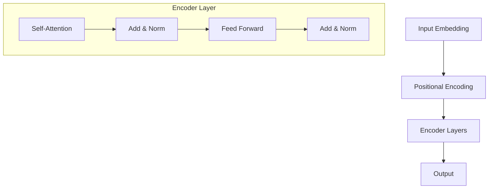
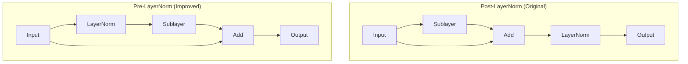

# Module 3.3: Layer Normalization in Transformers

This module explores how Layer Normalization is used in Transformer architectures, its critical role in these models, and best practices for implementation.

## 3.3.1 Introduction to Transformers

Before diving into how Layer Normalization is used in Transformers, let's briefly review what Transformers are and their key components.

### What are Transformers?

Transformers are a type of neural network architecture introduced in the paper "Attention is All You Need" by Vaswani et al. in 2017. They have revolutionized natural language processing and are now used in many other domains.

Key characteristics of Transformers:
- They rely entirely on attention mechanisms, without recurrence or convolution
- They process all tokens in parallel, unlike RNNs which process tokens sequentially
- They can capture long-range dependencies more effectively than previous architectures

### Basic Transformer Architecture

A Transformer consists of an encoder and a decoder, each containing multiple identical layers:




## 3.3.2 The Role of Layer Normalization in Transformers

Layer Normalization plays a crucial role in Transformer architectures. Let's examine where and why it's used.

### Where is Layer Normalization Used in Transformers?

In the original Transformer architecture, Layer Normalization is applied:

1. After the multi-head attention mechanism
2. After the feed-forward network

This is often referred to as the "Add & Norm" blocks in Transformer diagrams.

```python
def transformer_encoder_layer(x, attention_weights, ffn_weights):
    # Multi-head attention
    attention_output = attention(x, attention_weights)
    
    # Add & Norm (first residual connection)
    x1 = x + attention_output
    x1_norm = layer_norm(x1, gamma1, beta1)
    
    # Feed-forward network
    ffn_output = ffn(x1_norm, ffn_weights)
    
    # Add & Norm (second residual connection)
    x2 = x1_norm + ffn_output
    output = layer_norm(x2, gamma2, beta2)
    
    return output
```

### Why is Layer Normalization Important for Transformers?

Layer Normalization is particularly well-suited for Transformers for several reasons:

1. **Sequence Length Independence**: Unlike Batch Normalization, Layer Normalization doesn't depend on batch statistics, making it suitable for variable-length sequences.

2. **Stability in Deep Networks**: Transformers are typically deep networks, and Layer Normalization helps stabilize training by preventing internal covariate shift.

3. **Parallel Processing**: Transformers process all tokens in parallel, and Layer Normalization can be applied independently to each position in the sequence.

4. **Gradient Flow**: Layer Normalization helps gradients flow through the network, which is crucial for training deep Transformer models.

## 3.3.3 Pre-LayerNorm vs. Post-LayerNorm

There are two common ways to apply Layer Normalization in Transformers:

### Post-LayerNorm (Original Transformer)

In the original Transformer paper, Layer Normalization is applied after the residual connection:

```
x = x + Sublayer(x)
x = LayerNorm(x)
```

```python
def post_ln_transformer_layer(x, attention_fn, ffn_fn):
    # Multi-head attention block
    attn_output = attention_fn(x)
    x = x + attn_output  # Residual connection
    x = layer_norm(x, gamma1, beta1)  # Post-LN
    
    # Feed-forward block
    ffn_output = ffn_fn(x)
    x = x + ffn_output  # Residual connection
    x = layer_norm(x, gamma2, beta2)  # Post-LN
    
    return x
```

### Pre-LayerNorm (Improved Variant)

In more recent implementations, Layer Normalization is applied before each sub-layer:

```
x = x + Sublayer(LayerNorm(x))
```

```python
def pre_ln_transformer_layer(x, attention_fn, ffn_fn):
    # Multi-head attention block
    x_norm = layer_norm(x, gamma1, beta1)  # Pre-LN
    attn_output = attention_fn(x_norm)
    x = x + attn_output  # Residual connection
    
    # Feed-forward block
    x_norm = layer_norm(x, gamma2, beta2)  # Pre-LN
    ffn_output = ffn_fn(x_norm)
    x = x + ffn_output  # Residual connection
    
    return x
```

### Comparison of Pre-LN and Post-LN




### Advantages of Pre-LayerNorm

Pre-LayerNorm has several advantages over Post-LayerNorm:

1. **Training Stability**: Pre-LN provides more stable training, especially for deep Transformers
2. **Faster Convergence**: Models with Pre-LN typically converge faster
3. **Better Gradient Flow**: Pre-LN helps gradients flow more effectively through the network
4. **Easier Optimization**: Pre-LN makes the optimization landscape smoother

Research has shown that Pre-LayerNorm is generally more effective, especially for very deep Transformer models.

## 3.3.4 Implementation in Popular Transformer Models

Let's look at how Layer Normalization is implemented in some popular Transformer models:

### BERT (Bidirectional Encoder Representations from Transformers)

BERT uses the original Post-LayerNorm configuration:

```python
class BERTEncoderLayer(nn.Module):
    def __init__(self, hidden_size, num_attention_heads, intermediate_size, dropout_prob=0.1):
        super(BERTEncoderLayer, self).__init__()
        
        # Multi-head attention
        self.attention = BERTAttention(hidden_size, num_attention_heads, dropout_prob)
        
        # Feed-forward network
        self.intermediate = BERTIntermediate(hidden_size, intermediate_size)
        self.output = BERTOutput(intermediate_size, hidden_size, dropout_prob)
        
        # Layer normalization
        self.attention_layer_norm = nn.LayerNorm(hidden_size, eps=1e-12)
        self.output_layer_norm = nn.LayerNorm(hidden_size, eps=1e-12)
        
    def forward(self, hidden_states, attention_mask=None):
        # Multi-head attention
        attention_output = self.attention(hidden_states, attention_mask)
        
        # Add & Norm (first residual connection)
        attention_output = self.attention_layer_norm(attention_output + hidden_states)
        
        # Feed-forward network
        intermediate_output = self.intermediate(attention_output)
        layer_output = self.output(intermediate_output, attention_output)
        
        # Add & Norm (second residual connection)
        layer_output = self.output_layer_norm(layer_output + attention_output)
        
        return layer_output
```

### GPT-2 (Generative Pre-trained Transformer 2)

GPT-2 uses Pre-LayerNorm:

```python
class GPT2Block(nn.Module):
    def __init__(self, n_ctx, n_embd, n_head, dropout_prob=0.1):
        super(GPT2Block, self).__init__()
        
        # Layer normalization
        self.ln_1 = nn.LayerNorm(n_embd, eps=1e-5)
        self.ln_2 = nn.LayerNorm(n_embd, eps=1e-5)
        
        # Multi-head attention
        self.attn = GPT2Attention(n_ctx, n_embd, n_head, dropout_prob)
        
        # Feed-forward network
        self.mlp = GPT2MLP(n_embd, dropout_prob)
        
    def forward(self, x, attention_mask=None):
        # Pre-LN for attention
        a = self.ln_1(x)
        a = self.attn(a, attention_mask)
        x = x + a
        
        # Pre-LN for feed-forward
        m = self.ln_2(x)
        m = self.mlp(m)
        x = x + m
        
        return x
```

### Transformer-XL

Transformer-XL also uses Pre-LayerNorm:

```python
class TransformerXLLayer(nn.Module):
    def __init__(self, n_head, d_model, d_head, d_inner, dropout):
        super(TransformerXLLayer, self).__init__()
        
        # Layer normalization
        self.layer_norm1 = nn.LayerNorm(d_model)
        self.layer_norm2 = nn.LayerNorm(d_model)
        
        # Multi-head attention
        self.rel_attn = RelativeMultiHeadAttn(n_head, d_model, d_head, dropout)
        
        # Position-wise feed-forward network
        self.pos_ff = PositionwiseFF(d_model, d_inner, dropout)
        
    def forward(self, h, r, attn_mask=None, mems=None):
        # Pre-LN for attention
        attn_out = self.rel_attn(self.layer_norm1(h), r, attn_mask, mems)
        h = h + attn_out
        
        # Pre-LN for feed-forward
        ff_out = self.pos_ff(self.layer_norm2(h))
        h = h + ff_out
        
        return h
```

## 3.3.5 Layer Normalization in Transformer Variants

Different Transformer variants may use Layer Normalization in slightly different ways:

### Vision Transformer (ViT)

Vision Transformer applies Layer Normalization before the multi-head attention and feed-forward network (Pre-LN):

```python
class ViTBlock(nn.Module):
    def __init__(self, dim, num_heads, mlp_ratio=4.0, dropout=0.0):
        super(ViTBlock, self).__init__()
        
        # Layer normalization
        self.norm1 = nn.LayerNorm(dim, eps=1e-6)
        self.norm2 = nn.LayerNorm(dim, eps=1e-6)
        
        # Multi-head attention
        self.attn = MultiHeadAttention(dim, num_heads, dropout)
        
        # MLP
        hidden_features = int(dim * mlp_ratio)
        self.mlp = MLP(dim, hidden_features, dim, dropout)
        
    def forward(self, x):
        # Pre-LN for attention
        x = x + self.attn(self.norm1(x))
        
        # Pre-LN for MLP
        x = x + self.mlp(self.norm2(x))
        
        return x
```

### T5 (Text-to-Text Transfer Transformer)

T5 uses a variant of Layer Normalization called RMSNorm, which only normalizes by the root mean square without centering:

```python
class T5LayerNorm(nn.Module):
    def __init__(self, hidden_size, eps=1e-6):
        super(T5LayerNorm, self).__init__()
        self.weight = nn.Parameter(torch.ones(hidden_size))
        self.variance_epsilon = eps

    def forward(self, x):
        # Calculate RMS
        variance = x.pow(2).mean(-1, keepdim=True)
        x = x / torch.sqrt(variance + self.variance_epsilon)
        
        # Scale
        return self.weight * x
```

### ALBERT (A Lite BERT)

ALBERT uses Layer Normalization with careful initialization to improve training stability:

```python
class ALBERTLayerNorm(nn.Module):
    def __init__(self, hidden_size, eps=1e-12):
        super(ALBERTLayerNorm, self).__init__()
        self.gamma = nn.Parameter(torch.ones(hidden_size))
        self.beta = nn.Parameter(torch.zeros(hidden_size))
        self.variance_epsilon = eps

    def forward(self, x):
        mean = x.mean(-1, keepdim=True)
        variance = x.pow(2).mean(-1, keepdim=True) - mean.pow(2)
        x = (x - mean) / torch.sqrt(variance + self.variance_epsilon)
        return self.gamma * x + self.beta
```

## 3.3.6 Best Practices for Layer Normalization in Transformers

Based on research and practical experience, here are some best practices for using Layer Normalization in Transformers:

### Architecture Design

1. **Use Pre-LayerNorm**: For most applications, especially deep Transformers, Pre-LayerNorm is more stable and converges faster.

2. **Consistent Normalization**: Use the same normalization approach throughout the model for consistency.

3. **Consider RMSNorm**: For very large models, RMSNorm can be more efficient while maintaining performance.

### Hyperparameters

1. **Epsilon Value**: Use a small epsilon value (1e-5 to 1e-6) for numerical stability.

2. **Initialization**: Initialize gamma (scale) to 1 and beta (shift) to 0.

3. **Learning Rate**: Pre-LayerNorm typically allows for higher learning rates than Post-LayerNorm.

### Implementation

1. **Fused Operations**: Use fused operations for Layer Normalization when available for better performance.

2. **Mixed Precision**: Layer Normalization works well with mixed precision training, but be careful with the epsilon value.

3. **Memory Efficiency**: Consider using memory-efficient implementations for very large models.

## 3.3.7 Case Study: Layer Normalization in GPT Models

Let's examine how Layer Normalization is used in GPT (Generative Pre-trained Transformer) models, which are among the most successful Transformer-based language models.

### GPT Architecture

GPT models use a decoder-only Transformer architecture with Pre-LayerNorm:

```python
class GPTBlock(nn.Module):
    def __init__(self, config):
        super(GPTBlock, self).__init__()
        self.ln_1 = nn.LayerNorm(config.n_embd, eps=config.layer_norm_epsilon)
        self.attn = SelfAttention(config)
        self.ln_2 = nn.LayerNorm(config.n_embd, eps=config.layer_norm_epsilon)
        self.mlp = MLP(config)

    def forward(self, x, attention_mask=None):
        # Pre-LN for attention
        attn_output = self.attn(self.ln_1(x), attention_mask)
        x = x + attn_output
        
        # Pre-LN for MLP
        mlp_output = self.mlp(self.ln_2(x))
        x = x + mlp_output
        
        return x
```

### Scaling to Larger Models

As GPT models have scaled from GPT (117M parameters) to GPT-3 (175B parameters), Layer Normalization has remained a crucial component for training stability.

For very large models like GPT-3, careful implementation of Layer Normalization is essential:

1. **Numerical Precision**: Using appropriate epsilon values becomes even more important
2. **Initialization**: Careful initialization of gamma and beta helps with training stability
3. **Gradient Clipping**: Combined with Layer Normalization, gradient clipping helps prevent training instability

## Summary

In this module, we've explored how Layer Normalization is used in Transformer architectures:

1. **Role in Transformers**: Layer Normalization is a crucial component in Transformers, applied after attention and feed-forward layers
2. **Pre-LN vs. Post-LN**: Pre-LayerNorm provides better training stability and convergence compared to the original Post-LayerNorm
3. **Implementation in Popular Models**: Different Transformer variants like BERT, GPT, and ViT use Layer Normalization in slightly different ways
4. **Best Practices**: Guidelines for effectively using Layer Normalization in Transformer models
5. **Case Study**: How Layer Normalization is used in GPT models and scales to larger architectures

Layer Normalization has been a key enabler for the success of Transformer models, allowing them to be trained effectively and scaled to unprecedented sizes.

## Practice Exercises

1. Implement both Pre-LayerNorm and Post-LayerNorm Transformer encoder layers and compare their training dynamics.
2. Experiment with different epsilon values in Layer Normalization and observe their effect on training stability.
3. Implement RMSNorm and compare its performance with standard Layer Normalization in a simple Transformer model.
4. Analyze the gradient flow in Pre-LayerNorm and Post-LayerNorm architectures using gradient visualization techniques.
5. Implement a Transformer variant that uses Layer Normalization in a novel way and evaluate its performance.
