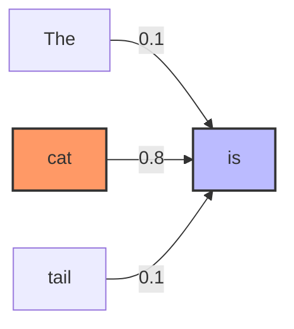
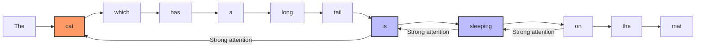

# Mini-Course: Understanding Attention Scores in Transformers

## Introduction

Attention scores are at the heart of the attention mechanism, the key innovation that made Transformer models so powerful. This mini-course explains what attention scores are, how they're calculated, and why they're so important in natural language processing.

## Table of Contents

1. [What is Attention?](#what-is-attention)
2. [Attention Explained Simply](#attention-explained-simply)
3. [Calculating Attention Scores](#calculating-attention-scores)
4. [Visualizing Attention Scores](#visualizing-attention-scores)
5. [Multi-Head Attention](#multi-head-attention)
6. [Impact of Attention Scores](#impact-of-attention-scores)
7. [Practical Exercises](#practical-exercises)

## What is Attention?

Attention is a mechanism that allows a model to focus on certain parts of an input sequence when processing a specific element. It's similar to how you might focus on certain key words when reading a complex sentence to understand its overall meaning.

In Transformer models, attention enables:
- Capturing long-range dependencies between words
- Processing sequences in parallel (unlike RNNs)
- Creating rich contextual representations for each word

## Attention Explained Simply

Let's understand attention with a simple, intuitive explanation without any complex math.

### The Basic Idea: Weighted Connections



Imagine you're reading the sentence: "The cat, which has a long tail, is sleeping on the mat."

When you reach the word "is," you need to connect it back to "cat" (not "tail") to understand the sentence correctly. Attention helps the model make these connections.

### Step-by-Step Process

1. **For each word, create three versions:**
   - A **question** version (Query): "What am I looking for?"
   - A **label** version (Key): "This is what I contain"
   - A **content** version (Value): "This is my information"

   ```mermaid
   graph LR
       A[Word: "cat"] --> B[Query: "I need a verb"]
       A --> C[Key: "I'm a subject"]
       A --> D[Value: "feline animal"]
       style A fill:#f9f,stroke:#333,stroke-width:2px
       style B fill:#bbf,stroke:#333,stroke-width:2px
       style C fill:#bfb,stroke:#333,stroke-width:2px
       style D fill:#fbf,stroke:#333,stroke-width:2px
   ```

2. **Ask questions and get scores:**
   - For each word, take its question (Query) and compare it with every word's label (Key)
   - Words that match well get high scores, others get low scores
   - Example: The word "is" might ask "I need to find my subject" and the word "cat" has a label that says "I'm a subject"

   ```mermaid
   graph LR
       A["Query from 'is': <br>I need a subject"] --> |Compare| B["Key from 'cat': <br>I'm a subject"]
       A --> |Compare| C["Key from 'tail': <br>I'm an object"]
       B --> D["Score: 0.8 <br>(high match)"]
       C --> E["Score: 0.1 <br>(low match)"]
       style A fill:#bbf,stroke:#333,stroke-width:2px
       style D fill:#bfb,stroke:#333,stroke-width:2px
       style E fill:#fbb,stroke:#333,stroke-width:2px
   ```

3. **Convert scores to percentages:**
   - Turn all scores into percentages that add up to 100%
   - These percentages are the "attention weights"
   - Example: "is" might give 80% attention to "cat", 5% to "tail", 15% to other words

   ```mermaid
   graph TD
       A[Raw Scores] --> B[Apply Softmax]
       B --> C[Attention Weights]
       C --> D["cat: 80%"]
       C --> E["tail: 5%"]
       C --> F["other words: 15%"]
       style B fill:#bbf,stroke:#333,stroke-width:2px
       style C fill:#bfb,stroke:#333,stroke-width:2px
   ```

4. **Collect information based on percentages:**
   - Take a percentage of each word's content (Value) based on the attention weights
   - Add all these pieces together to create a new representation for the current word
   - This new representation contains information from all relevant words, weighted by importance

   ```mermaid
   graph LR
       A["Value from 'cat'"] --> |80%| D["New representation <br>for 'is'"]
       B["Value from 'tail'"] --> |5%| D
       C["Values from <br>other words"] --> |15%| D
       style D fill:#bbf,stroke:#333,stroke-width:2px
   ```


### Real-World Analogy: Research Paper

Imagine you're writing a research paper:

1. You have a **specific question** (Query) you're trying to answer
2. You scan through **book titles and abstracts** (Keys) to find relevant sources
3. You assign **importance levels** to each source (Attention Weights)
4. You extract **information** (Values) from each source according to its importance
5. You **combine** this information to write your paper

### Why This Matters

This simple mechanism allows Transformer models to:

- Connect related words even if they're far apart
- Understand complex relationships in language
- Focus on what's important and ignore what's not
- Learn different types of relationships (grammatical, semantic, etc.)



In the next section, we'll look at the mathematical details of how attention scores are calculated.

## Calculating Attention Scores

Attention scores are calculated in three main steps:

### 1. Projecting Query, Key, and Value Vectors

Each word in the sequence is first transformed into three different vectors:
- **Query (Q)**: What we're looking for
- **Key (K)**: What we're comparing against
- **Value (V)**: What we're retrieving

These vectors are obtained by linear projection of the initial embedding vector:

```
Q = W_Q * X
K = W_K * X
V = W_V * X
```

Where X is the embedding vector and W_Q, W_K, W_V are learnable weight matrices.

### 2. Computing Compatibility Scores

Compatibility scores are calculated by taking the dot product between each Query and all Keys:

```
Score = Q * K^T
```

This score indicates how relevant each word (represented by its Key) is to the current word (represented by its Query).

### 3. Normalization and Weighting

The scores are then normalized by the square root of the dimension of the Key vectors to stabilize learning:

```
Normalized_Score = Score / √d_k
```

Then, a softmax function is applied to obtain a probability distribution:

```
Attention_weights = softmax(Normalized_Score)
```

Finally, these weights are used to calculate a weighted sum of the Value vectors:

```
Output = Attention_weights * V
```

The complete formula for the attention mechanism is therefore:

```
Attention(Q, K, V) = softmax(QK^T / √d_k)V
```

## Visualizing Attention Scores

Attention scores can be visualized as heatmaps to understand how the model focuses on different parts of the sequence.

Example visualization for the sentence "The cat sleeps on the mat":

```
   | The | cat | sleeps | on | the | mat |
---+-----+-----+--------+----+-----+-----|
The | 0.7 | 0.1 |  0.05  |0.05| 0.1 | 0.0 |
cat | 0.1 | 0.6 |  0.2   |0.05| 0.0 | 0.05|
sleeps| 0.0 | 0.3 |  0.5   |0.1 | 0.0 | 0.1 |
on  | 0.0 | 0.1 |  0.1   |0.6 | 0.1 | 0.1 |
the | 0.1 | 0.0 |  0.0   |0.1 | 0.3 | 0.5 |
mat | 0.0 | 0.05|  0.05  |0.1 | 0.2 | 0.6 |
```

In this visualization, each cell represents the attention weight between the word in the row and the word in the column. The higher the value (and the darker the color), the stronger the attention.

## Multi-Head Attention

In practice, Transformers use Multi-Head Attention, which involves running several attention mechanisms in parallel, each with its own projection matrices W_Q, W_K, and W_V.

```
MultiHead(Q, K, V) = Concat(head_1, head_2, ..., head_h) * W_O

where head_i = Attention(Q * W_Q_i, K * W_K_i, V * W_V_i)
```

Advantages of Multi-Head Attention:
- Each head can focus on different aspects of the sequence
- Some heads may capture syntax, others semantics
- Improves the model's ability to model complex relationships

## Impact of Attention Scores

Attention scores have a major impact on the performance of Transformer models:

1. **Contextualization**: They allow for creating contextual representations of words, taking into account their environment
2. **Disambiguation**: They help resolve ambiguities by focusing on relevant words
3. **Translation**: In machine translation, they implicitly align words between source and target languages
4. **Interpretability**: They provide insight into how the model "reasons" about text

## Practical Exercises

### Exercise 1: Manual Calculation of Attention Scores

Consider a sequence of 3 words with simplified embedding vectors of dimension 2:
- Word 1: [1, 0]
- Word 2: [0, 1]
- Word 3: [1, 1]

With simplified projection matrices:
- W_Q = [[1, 0], [0, 1]]
- W_K = [[1, 0], [0, 1]]
- W_V = [[1, 0], [0, 1]]

Calculate the attention scores for this sequence.

### Exercise 2: Analyzing an Attention Map

Observe the following attention map for the translation of "The cat sits on the mat" to "Le chat est assis sur le tapis":

```
            | The | cat | sits | on  | the | mat |
------------+-----+-----+------+-----+-----+-----|
Le          | 0.8 | 0.1 | 0.0  | 0.0 | 0.1 | 0.0 |
chat        | 0.1 | 0.8 | 0.1  | 0.0 | 0.0 | 0.0 |
est         | 0.0 | 0.1 | 0.4  | 0.3 | 0.1 | 0.1 |
assis       | 0.0 | 0.1 | 0.7  | 0.1 | 0.0 | 0.1 |
sur         | 0.0 | 0.0 | 0.1  | 0.8 | 0.1 | 0.0 |
le          | 0.1 | 0.0 | 0.0  | 0.1 | 0.7 | 0.1 |
tapis       | 0.0 | 0.0 | 0.0  | 0.1 | 0.1 | 0.8 |
```

Questions:
1. Which words are strongly linked in the translation?
2. Are there any words that pay attention to multiple source words?
3. How does attention help in correctly translating "sits" to "est assis" (two words in French)?

## Conclusion

Attention scores are a fundamental mechanism that has transformed the field of NLP. By allowing models to dynamically focus on different parts of a sequence, they have paved the way for more powerful and interpretable architectures.

In modern Transformer models like BERT, GPT, and T5, attention mechanisms have become even more sophisticated, with variants such as sparse attention, local attention, or attention with structural constraints.

Understanding attention scores is essential for anyone who wants to master the inner workings of modern language models and develop advanced NLP applications.

---

## Additional Resources

- [The Illustrated Transformer](http://jalammar.github.io/illustrated-transformer/) by Jay Alammar
- [Attention Is All You Need](https://arxiv.org/abs/1706.03762) - Original paper on Transformers
- [The Annotated Transformer](https://nlp.seas.harvard.edu/2018/04/03/attention.html) - Annotated implementation of the Transformer
- [Visualizing Attention in Transformer-Based Language Models](https://towardsdatascience.com/visualizing-attention-in-transformer-based-language-models-9a1d0c2c4c10) - Article on visualizing attention
