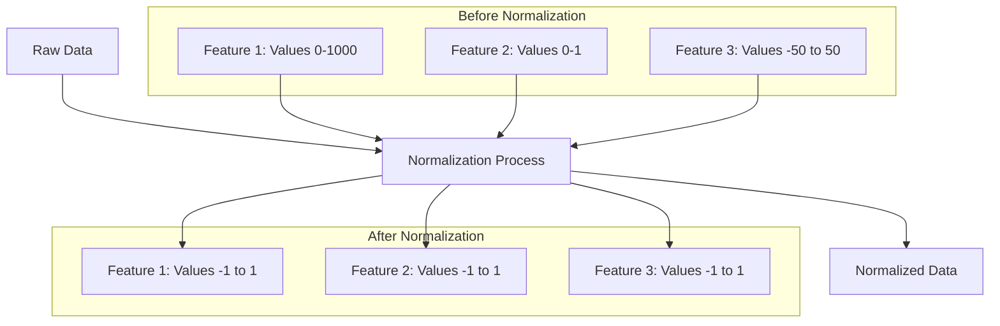
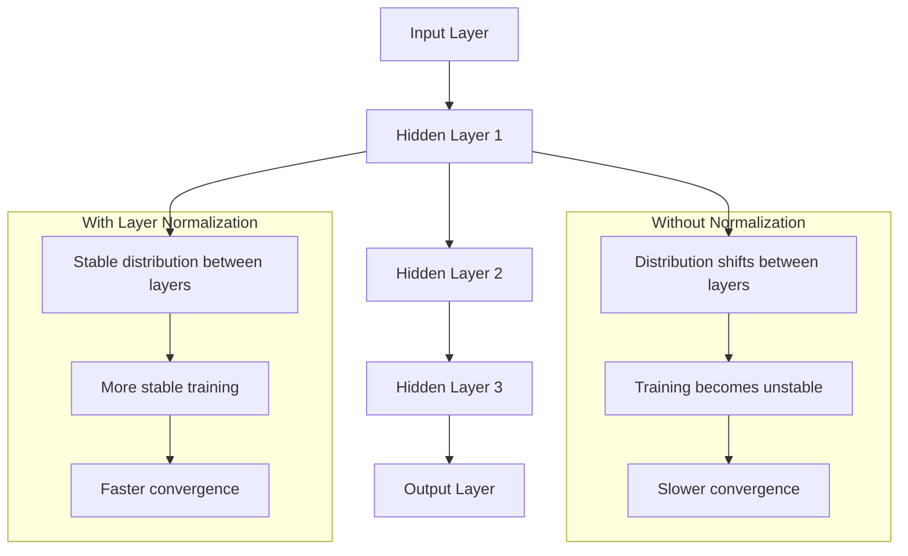
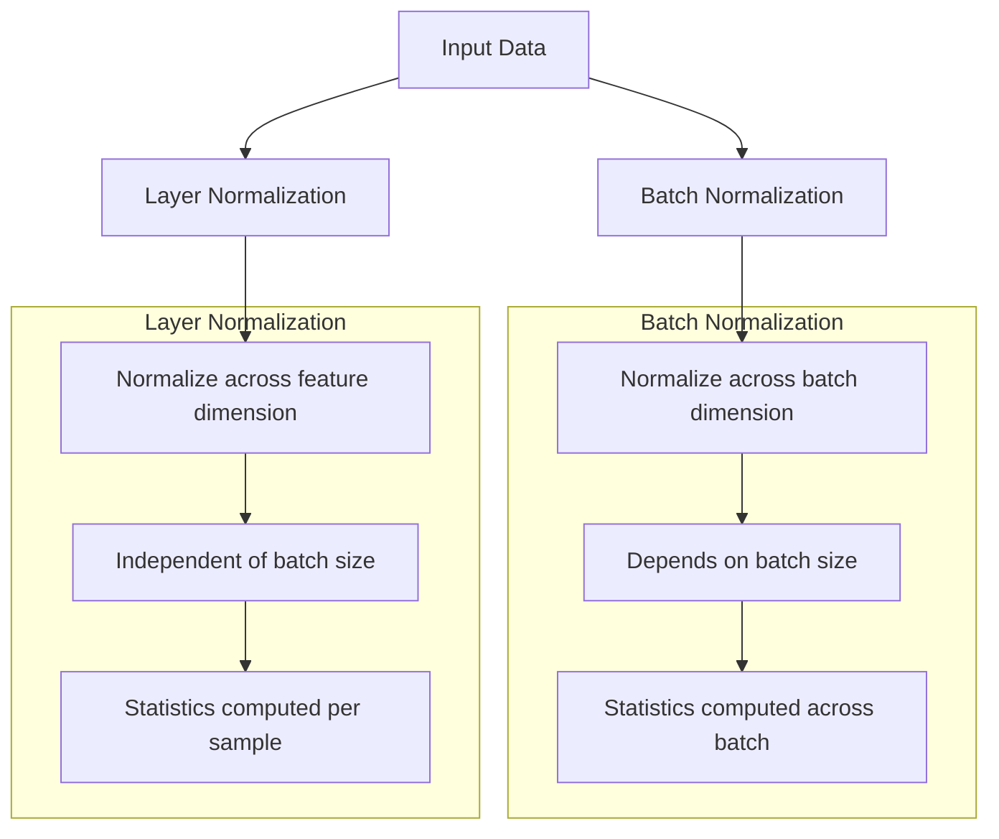
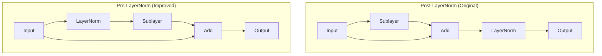

# Layer Normalization Diagrams

## Basic Normalization Concept



## Internal Covariate Shift



## Layer Normalization vs Batch Normalization



## Layer Normalization in Transformer

```mermaid
graph TD
    A[Input Embedding] --> B[Add Positional Encoding]
    B --> C[Layer Norm]
    C --> D[Multi-Head Attention]
    D --> E[Add & Layer Norm]
    E --> F[Feed Forward Network]
    F --> G[Add & Layer Norm]
    G --> H[Output]
    
    subgraph "Layer Normalization Details"
    I[Calculate Mean]
    J[Calculate Variance]
    K[Normalize: (x-mean)/sqrt(var+eps)]
    L[Scale and Shift: γ*x + β]
    end
    
    C --> I
    I --> J
    J --> K
    K --> L
```

## Pre-LayerNorm vs Post-LayerNorm



## Layer Normalization Computation Flow

```mermaid
graph TD
    A[Input Tensor x] --> B[Calculate Mean μ]
    A --> C[Calculate Variance σ²]
    B --> D[Normalize: (x-μ)/sqrt(σ²+ε)]
    C --> D
    D --> E[Apply Scale γ]
    E --> F[Apply Shift β]
    F --> G[Output Tensor y]
    
    subgraph "Learnable Parameters"
    H[Scale Parameter γ]
    I[Shift Parameter β]
    end
    
    H --> E
    I --> F
```
