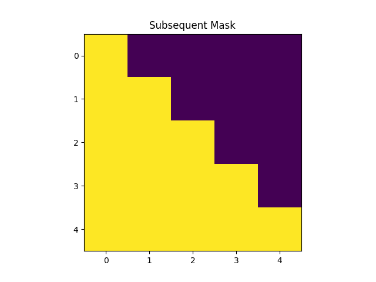

# Exploring Transformers: The Journey Begins

*Posted on: 2023-11-15*

Welcome to the first blog post for the FoNu_NLP_TG project! This blog will serve as a platform to share our progress, insights, and discoveries as we explore and experiment with transformer models for natural language processing tasks.

## What is FoNu_NLP_TG?

FoNu_NLP_TG ("Fo Nu" means "speak" in Ewe, and TG stands for Togo) is a research project focused on experimenting, exploring, and fine-tuning transformer models for various NLP tasks, with a special emphasis on applications for Togolese languages. Our primary goals are:

1. Understanding the inner workings of transformer architectures
2. Implementing and visualizing key components of transformers
3. Applying transformers to low-resource language translation, particularly Ewe-English translation
4. Developing tools to visualize semantic relationships between words

## Why Transformers?

Since their introduction in the 2017 paper ["Attention Is All You Need"](https://arxiv.org/pdf/1706.03762), transformers have revolutionized natural language processing. Unlike previous sequence models that process text sequentially (word by word), transformers can process entire sequences in parallel, making them more efficient and effective for capturing long-range dependencies in text.

The standard transformer architecture consists of:

1. **Encoder**: N layers (usually 6) with self-attention and feed-forward networks
2. **Decoder**: N layers with self-attention, source-attention (to encoder), and feed-forward networks
3. **Attention Mechanism**: The key innovation that allows the model to weigh the importance of different words in a sequence

*The standard transformer architecture (Image from Harvard NLP)*

## Current Focus: Ewe-English Translation

One of our main applications is machine translation between Ewe (a language spoken in Ghana, Togo, and parts of Benin) and English. This is particularly challenging because:

1. Ewe is a low-resource language with limited digital text available
2. The linguistic structures of Ewe and English differ significantly
3. There are cultural nuances that need to be preserved in translation

We're exploring several approaches to this challenge:

### Transformer-Based Approaches

- Fine-tuning pre-trained multilingual models like mBART and mT5
- Training custom transformer models specifically for Ewe-English translation
- Implementing hybrid approaches that combine neural and statistical methods

### Transfer Learning Approaches

- Leveraging knowledge from models trained on related languages
- Using multilingual pre-training to improve performance on Ewe
- Implementing parameter sharing strategies across languages

## Visualizing Transformers

Understanding transformers requires visualizing their components. We've implemented several visualization tools:

### Attention Visualization

The attention mechanism is the heart of transformer models. It calculates "scores" between words to determine their relationships. For example, in the sentence "Hello world", the model checks how much "Hello" relates to "world" using their hidden states.

*Visualization of a subsequent mask used in transformer decoders*

### Semantic Relationships

We've also developed a Semantics Visualizer (SV) tool that helps visualize word embeddings and their relationships in semantic space. This tool reduces the high-dimensional word vectors to 2D space using Principal Component Analysis (PCA).

/semantic_relationships.png)
*Visualization of semantic relationships between words*

## What's Next?

In the coming weeks and months, we'll be:

1. Implementing the full transformer architecture based on the original paper
2. Collecting and preprocessing more Ewe-English parallel data
3. Training initial translation models and evaluating their performance
4. Refining our visualization tools to better understand model behavior

We're excited to share this journey with you and welcome feedback, suggestions, and collaborations. Stay tuned for more updates as we dive deeper into the world of transformers!

---

*This blog will be updated with each release of the project. If you're interested in contributing or have questions, please check out our [GitHub repository](https://github.com/Lemniscate-world/FoNu_NLP_TG/).*
