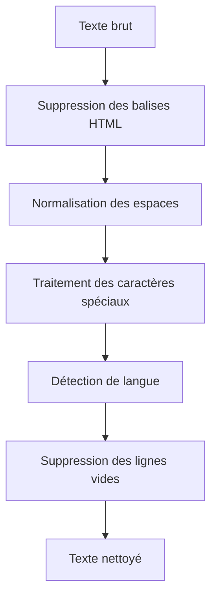
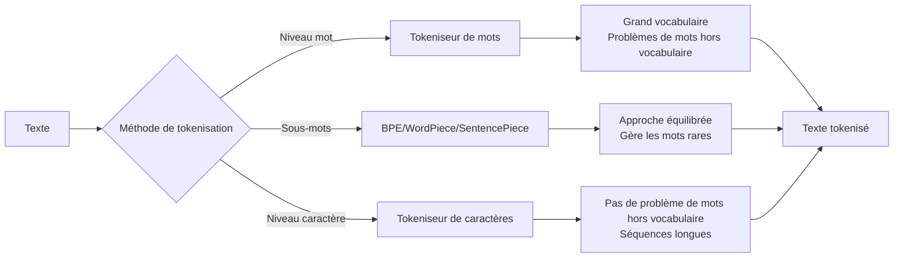
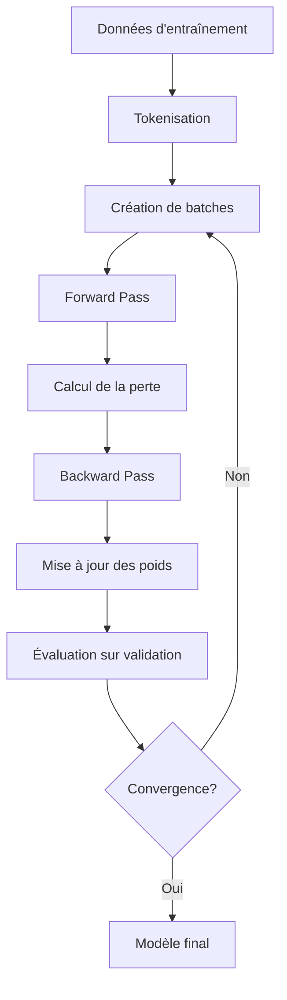

# Cours Complet sur FoNu_NLP_TG

## Introduction

Bienvenue dans ce cours complet sur le projet FoNu_NLP_TG ! Ce cours est conçu pour les débutants qui souhaitent comprendre les bases du traitement automatique du langage naturel (NLP) et des modèles de transformers, avec une application spécifique à la traduction entre l'Ewe (une langue togolaise) et l'anglais.

> **Note**: "Fo Nu" signifie "parler" en langue Ewe, et "TG" fait référence au Togo.

## Table des matières

1. [Introduction au Traitement Automatique du Langage Naturel](#1-introduction-au-traitement-automatique-du-langage-naturel)
2. [Comprendre les Transformers](#2-comprendre-les-transformers)
3. [Structure du Projet FoNu_NLP_TG](#3-structure-du-projet-fonu_nlp_tg)
4. [Préparation des Données](#4-préparation-des-données)
5. [Tokenisation](#5-tokenisation)
6. [Architecture du Modèle Transformer](#6-architecture-du-modèle-transformer)
7. [Entraînement du Modèle](#7-entraînement-du-modèle)
8. [Inférence et Traduction](#8-inférence-et-traduction)
9. [Visualisation des Résultats](#9-visualisation-des-résultats)
10. [Déploiement et Utilisation](#10-déploiement-et-utilisation)
11. [Ressources Complémentaires](#11-ressources-complémentaires)

## 1. Introduction au Traitement Automatique du Langage Naturel

### Qu'est-ce que le NLP ?

Le Traitement Automatique du Langage Naturel (NLP) est un domaine de l'intelligence artificielle qui se concentre sur l'interaction entre les ordinateurs et le langage humain. L'objectif est de permettre aux machines de comprendre, interpréter et générer du langage humain de manière utile.

### Applications du NLP

- **Traduction automatique** : Traduire du texte d'une langue à une autre (comme notre projet FoNu_NLP_TG)
- **Reconnaissance vocale** : Convertir la parole en texte
- **Analyse de sentiment** : Déterminer si un texte exprime une opinion positive, négative ou neutre
- **Génération de texte** : Créer du texte cohérent et pertinent
- **Chatbots et assistants virtuels** : Interagir avec les utilisateurs en langage naturel

### Défis du NLP

- **Ambiguïté du langage** : Un même mot peut avoir plusieurs significations selon le contexte
- **Variations linguistiques** : Dialectes, argot, expressions idiomatiques
- **Langues à faibles ressources** : Manque de données pour certaines langues (comme l'Ewe)
- **Nuances culturelles** : Expressions et références propres à une culture

## 2. Comprendre les Transformers

### Évolution des modèles de NLP

1. **Approches basées sur des règles** : Systèmes utilisant des règles linguistiques prédéfinies
2. **Modèles statistiques** : Utilisation de probabilités basées sur des corpus de texte
3. **Réseaux de neurones récurrents (RNN)** : Modèles capables de traiter des séquences
4. **Transformers** : Architecture révolutionnaire basée sur le mécanisme d'attention

### Qu'est-ce qu'un Transformer ?

Le Transformer est une architecture de réseau neuronal introduite en 2017 dans l'article "Attention Is All You Need" par des chercheurs de Google. Cette architecture a révolutionné le domaine du NLP grâce à plusieurs innovations :

- **Mécanisme d'attention** : Permet au modèle de se concentrer sur différentes parties de l'entrée lors du traitement
- **Traitement parallèle** : Contrairement aux RNN, les Transformers peuvent traiter tous les mots d'une phrase simultanément
- **Encodeur-Décodeur** : Architecture composée d'un encodeur qui traite l'entrée et d'un décodeur qui génère la sortie

### Avantages des Transformers

- **Performance supérieure** : Résultats état-de-l'art sur de nombreuses tâches de NLP
- **Capacité à capturer les dépendances à long terme** : Comprendre les relations entre des mots éloignés dans une phrase
- **Scalabilité** : Possibilité d'entraîner des modèles de plus en plus grands
- **Transfert d'apprentissage** : Capacité à utiliser des connaissances acquises sur une tâche pour en résoudre une autre

## 3. Structure du Projet FoNu_NLP_TG

Le projet FoNu_NLP_TG est organisé en plusieurs composants principaux, chacun ayant un rôle spécifique dans le processus de traduction Ewe-Anglais.

### Vue d'ensemble des dossiers

```
FoNu_NLP_TG/
├── Attention_Is_All_You_Need/     # Implémentation du modèle Transformer
├── SV(Semantics_Visualizer)/      # Outils de visualisation sémantique
├── data_processing/               # Traitement et préparation des données
├── Ewe_News_Dataset/              # Scripts pour le dataset de nouvelles en Ewe
├── Kaggle_dataset/                # Scripts pour les datasets de Kaggle
├── Tensorflow_Ytb_Channel/        # Implémentations basées sur TensorFlow
└── blog/                          # Blog documentant le projet
```

### Composants principaux

#### Attention_Is_All_You_Need

Ce dossier contient l'implémentation du modèle Transformer basé sur l'article original "Attention Is All You Need", adapté pour la traduction Ewe-Anglais.

Fichiers clés :
- `model_utils.py` : Composants de base du Transformer (LayerNorm, Encoder, Decoder, etc.)
- `encode_decode.py` : Modèle EncodeDecode qui combine l'encodeur et le décodeur
- `inference.py` : Script d'inférence pour tester le modèle
- `training.py` : Script d'entraînement du modèle
- `visualization.py` : Outils de visualisation des composants du Transformer

#### SV(Semantics_Visualizer)

Outils pour visualiser les embeddings de mots et les relations sémantiques entre les mots.

Fichiers clés :
- `SV.py` : Implémentation principale du visualiseur sémantique
- `kaggle_semantics_visualizer.ipynb` : Version notebook pour Kaggle

#### data_processing

Outils et utilitaires pour la préparation des données, la tokenisation et la gestion des datasets.

Fichiers clés :
- `tokenizer_trainer.py` : Scripts pour l'entraînement des tokenizers
- `data_cleaner.py` : Nettoyage et prétraitement des données
- `transformer_dataset.py` : Classes de dataset pour le chargement et le traitement par lots des données

## 4. Préparation des Données

La préparation des données est une étape cruciale dans tout projet de NLP. Pour la traduction Ewe-Anglais, nous devons collecter, nettoyer et préparer des paires de phrases parallèles.

### Sources de données

Le projet utilise plusieurs sources de données :

1. **Kaggle** : Dataset de paires bilingues Ewe-Anglais
2. **Zindi** : Dataset contenant des paires Français-Ewe
3. **OPUS** : Corpus parallèles multilingues

### Processus de nettoyage des données



#### Étapes de nettoyage

1. **Suppression des balises HTML** : Éliminer les balises et le code HTML
2. **Normalisation des espaces** : Remplacer les séquences d'espaces par un seul espace
3. **Traitement des caractères spéciaux** : Gérer ou supprimer les caractères non désirés
4. **Détection de langue** : Vérifier que les textes sont bien dans les langues attendues
5. **Suppression des lignes vides** : Éliminer les entrées sans contenu

### Filtrage des données

Après le nettoyage de base, nous appliquons plusieurs filtres pour améliorer la qualité des données :

1. **Filtrage par longueur** : Supprimer les phrases trop courtes ou trop longues
2. **Suppression des doublons** : Éliminer les paires de phrases répétées
3. **Filtrage par langue** : S'assurer que les textes sont bien dans la langue attendue

### Augmentation des données

Pour les langues à faibles ressources comme l'Ewe, l'augmentation des données est essentielle :

1. **Rétro-traduction (Back-translation)** : Traduire des phrases cibles vers la source, puis utiliser ces nouvelles paires
2. **Dropout de mots** : Supprimer aléatoirement certains mots pour créer des variations
3. **Remplacement de synonymes** : Remplacer des mots par leurs synonymes
4. **Ajout de bruit** : Introduire des erreurs mineures pour rendre le modèle plus robuste

## 5. Tokenisation

La tokenisation est le processus de conversion du texte en unités plus petites (tokens) que le modèle peut traiter.

### Types de tokenisation



#### Tokenisation au niveau des mots

- **Avantages** : Simple, préserve l'intégrité des mots
- **Inconvénients** : Vocabulaire très grand, problèmes avec les mots inconnus (OOV)
- **Exemple** : "J'aime les transformers" → ["J'aime", "les", "transformers"]

#### Tokenisation au niveau des sous-mots

- **Avantages** : Vocabulaire plus petit, gère mieux les mots rares et composés
- **Inconvénients** : Complexité accrue, perte partielle du sens des mots complets
- **Exemple** : "J'aime les transformers" → ["J'", "aime", "les", "transform", "ers"]

#### Tokenisation au niveau des caractères

- **Avantages** : Vocabulaire très petit, aucun problème de mot inconnu
- **Inconvénients** : Séquences très longues, perte du contexte des mots
- **Exemple** : "J'aime les transformers" → ["J", "'", "a", "i", "m", "e", " ", "l", "e", "s", " ", "t", "r", "a", "n", "s", "f", "o", "r", "m", "e", "r", "s"]

### SentencePiece

Dans le projet FoNu_NLP_TG, nous utilisons principalement SentencePiece, un algorithme de tokenisation qui :

1. Traite le texte comme une séquence de caractères Unicode
2. Apprend automatiquement un modèle de tokenisation à partir des données
3. Gère bien les langues sans espaces (comme le japonais) ou les langues à morphologie riche

### Entraînement des tokenizers

Le processus d'entraînement d'un tokenizer comprend :

1. **Préparation du corpus** : Collecter un large ensemble de textes dans la langue cible
2. **Configuration** : Définir la taille du vocabulaire et les paramètres d'entraînement
3. **Entraînement** : Apprendre les tokens les plus fréquents et utiles
4. **Sauvegarde** : Stocker le modèle de tokenisation pour une utilisation ultérieure

Dans notre projet, nous entraînons des tokenizers séparés pour l'Ewe et l'anglais, avec une taille de vocabulaire de 8000 tokens chacun.

## 6. Architecture du Modèle Transformer

L'architecture Transformer est au cœur du projet FoNu_NLP_TG. Comprendre ses composants est essentiel pour saisir le fonctionnement du système de traduction.

### Vue d'ensemble

Le Transformer est composé de deux parties principales :
1. **Encodeur** : Traite le texte source (Ewe)
2. **Décodeur** : Génère le texte cible (Anglais)

### Encodeur

L'encodeur est constitué de N couches identiques (généralement 6), chacune contenant :

1. **Multi-Head Attention** : Permet au modèle de se concentrer sur différentes parties de l'entrée
2. **Feed-Forward Network** : Réseau de neurones qui traite chaque position indépendamment
3. **Layer Normalization** : Normalise les activations pour stabiliser l'apprentissage
4. **Residual Connections** : Connexions résiduelles qui facilitent l'apprentissage des réseaux profonds

### Décodeur

Le décodeur est également constitué de N couches identiques, chacune contenant :

1. **Masked Multi-Head Attention** : Attention qui empêche le modèle de voir les positions futures
2. **Multi-Head Attention** : Attention qui se concentre sur l'encodeur
3. **Feed-Forward Network** : Réseau de neurones similaire à celui de l'encodeur
4. **Layer Normalization et Residual Connections** : Comme dans l'encodeur

### Mécanisme d'attention

Le mécanisme d'attention est l'innovation clé des Transformers. Il permet au modèle de pondérer l'importance de différents mots lors du traitement.

#### Multi-Head Attention

L'attention multi-têtes divise les vecteurs d'entrée en plusieurs "têtes" qui peuvent se concentrer sur différents aspects de la séquence.

```
Attention(Q, K, V) = softmax(QK^T / √d_k)V
```

Où :
- Q (Query) : Ce que nous cherchons
- K (Key) : Ce avec quoi nous comparons
- V (Value) : Ce que nous récupérons
- d_k : Dimension des vecteurs de clé

### Encodage positionnel

Contrairement aux RNN, les Transformers traitent tous les mots simultanément, perdant ainsi l'information sur l'ordre des mots. L'encodage positionnel résout ce problème en ajoutant des informations sur la position de chaque mot dans la séquence.

```
PE(pos, 2i) = sin(pos/10000^(2i/d_model))
PE(pos, 2i+1) = cos(pos/10000^(2i/d_model))
```

Où :
- pos : Position du mot dans la séquence
- i : Dimension de l'encodage
- d_model : Dimension du modèle

## 7. Entraînement du Modèle

L'entraînement d'un modèle Transformer pour la traduction implique plusieurs étapes et concepts importants.

### Préparation des données d'entraînement

1. **Chargement des paires de phrases** : Charger les paires Ewe-Anglais nettoyées
2. **Tokenisation** : Convertir les phrases en séquences de tokens
3. **Padding** : Ajouter des tokens spéciaux pour que toutes les séquences aient la même longueur
4. **Création des masques** : Générer des masques pour l'attention

### Fonction de perte et optimisation

1. **Cross-Entropy Loss** : Mesure l'écart entre la distribution prédite et la distribution réelle
2. **Label Smoothing** : Technique de régularisation qui "adoucit" les labels pour éviter la surconfiance
3. **Optimiseur Adam** : Algorithme d'optimisation adaptatif
4. **Learning Rate Scheduler** : Ajuste dynamiquement le taux d'apprentissage

### Processus d'entraînement



### Hyperparamètres importants

- **Taille du modèle (d_model)** : Dimension des vecteurs (généralement 512)
- **Nombre de couches (N)** : Nombre de couches d'encodeur et de décodeur (généralement 6)
- **Nombre de têtes d'attention (h)** : Nombre de têtes dans l'attention multi-têtes (généralement 8)
- **Dimension du feed-forward (d_ff)** : Dimension du réseau feed-forward (généralement 2048)
- **Taux de dropout** : Probabilité de désactiver des neurones pendant l'entraînement (généralement 0.1)

### Techniques d'entraînement avancées

1. **Transfert d'apprentissage** : Utiliser un modèle pré-entraîné sur d'autres langues
2. **Apprentissage multi-tâches** : Entraîner le modèle sur plusieurs paires de langues simultanément
3. **Curriculum Learning** : Commencer par des phrases simples puis augmenter progressivement la difficulté
4. **Mixed Precision Training** : Utiliser des nombres à virgule flottante de précision mixte pour accélérer l'entraînement

## 8. Inférence et Traduction

Une fois le modèle entraîné, nous pouvons l'utiliser pour traduire de nouvelles phrases de l'Ewe vers l'anglais.

### Processus d'inférence

1. **Tokenisation** : Convertir la phrase source en tokens
2. **Encodage** : Passer la séquence tokenisée à travers l'encodeur
3. **Décodage** : Générer la traduction token par token avec le décodeur
4. **Détokenisation** : Convertir les tokens en texte lisible

### Méthodes de décodage

#### Décodage glouton (Greedy Decoding)

À chaque étape, choisir le token avec la probabilité la plus élevée.

**Avantages** : Simple et rapide
**Inconvénients** : Peut conduire à des traductions sous-optimales

#### Recherche en faisceau (Beam Search)

Maintenir plusieurs hypothèses de traduction et choisir la meilleure.

**Avantages** : Meilleures traductions que le décodage glouton
**Inconvénients** : Plus lent et nécessite plus de mémoire

### Exemple d'inférence

```python
def inference_test():
    test_model = make_model(11, 11, 2)  # Taille de vocabulaire 11, 2 couches
    test_model.eval()  # Mode évaluation (pas de dropout)
    src = torch.LongTensor([[1, 2, 3, 4, 5, 6, 7, 8, 9, 10]])  # Séquence d'entrée
    src_mask = torch.ones(1, 1, 10)  # Pas de padding, toutes les positions visibles

    # Mémoire : Sortie de l'encodeur, représentation contextuelle de l'entrée
    memory = test_model.encode(src, src_mask)

    # Décodeur : Génère la séquence de sortie token par token
    ys = torch.zeros(1, 1).type_as(src)
    # Objectif : Générer une séquence de sortie de 10 tokens, un token à la fois
    for i in range(9):
        out = test_model.decode(
            memory, src_mask, ys, subsequent_mask(ys.size(1)).type_as(src.data)
        )
        prob = test_model.generator(out[:, -1])
        _, next_word = torch.max(prob, dim=1)  # Choisit le token avec la probabilité la plus élevée
        next_word = next_word.data[0]
        ys = torch.cat(
            [ys, torch.empty(1, 1).type_as(src.data).fill_(next_word)], dim=1
        )

    print("Prédiction du modèle non entraîné :", ys)
```

### Évaluation de la qualité de traduction

Plusieurs métriques sont utilisées pour évaluer la qualité des traductions :

1. **BLEU** : Mesure le chevauchement des n-grammes entre la traduction et la référence
2. **ROUGE** : Métrique orientée rappel pour le texte généré
3. **METEOR** : Prend en compte les synonymes et la dérivation
4. **chrF** : Score F basé sur les n-grammes de caractères
5. **BERTScore** : Similarité sémantique utilisant des embeddings contextuels

## 9. Visualisation des Résultats

La visualisation est un aspect important du projet FoNu_NLP_TG, permettant de mieux comprendre le fonctionnement du modèle et les relations entre les mots.

### Visualisation des masques d'attention

Les masques d'attention sont utilisés dans les Transformers pour contrôler quelles positions peuvent être prises en compte lors du calcul de l'attention.

```python
def visualize_mask(mask_size=20):
    """Créer une visualisation du masque subséquent."""
    LS_data = pd.concat(
        [pd.DataFrame(
            {"Subsequent Mask": subsequent_mask(mask_size)[0][x, y].flatten(),
             "Window": y,
             "Masking": x,
            }
            )
            for y in range(mask_size)
            for x in range(mask_size)
            ]
    )
    return (alt.Chart(LS_data).mark_rect().properties(height=250, width=250).encode(
        x='Window:O',
        y='Masking:O',
        color=alt.Color('Subsequent Mask:Q', scale=alt.Scale(scheme='viridis'))
    ).interactive())
```

### Visualisation des poids d'attention

Les poids d'attention montrent comment le modèle se concentre sur différentes parties de l'entrée lors de la génération de la sortie.

### Visualisation des relations sémantiques

Le module SV (Semantics Visualizer) permet de visualiser les relations sémantiques entre les mots dans l'espace d'embedding.

```python
# Outil pour la réduction de dimensionnalité
from sklearn.decomposition import PCA
import matplotlib.pyplot as plt
# Une classe pour charger et travailler avec des embeddings de mots pré-entraînés
from gensim.models import KeyedVectors

# Charger le modèle word2vec pré-entraîné sur les données Google News
model = KeyedVectors.load_word2vec_format('GoogleNews-vectors-negative300.bin', binary=True)

words = ['king', 'queen', 'man', 'woman', 'prince', 'princess', 'boy', 'girl']
vectors = [model[word] for word in words]

# Objet PCA pour réduire les données à 2 dimensions (pour pouvoir les tracer dans un espace 2D)
pca = PCA(n_components=2)
# Transformer les vecteurs en 2 dimensions
reduced_vectors = pca.fit_transform(vectors)

plt.figure(figsize=(8, 6))
for i, word in enumerate(words):
    plt.scatter(reduced_vectors[i, 0], reduced_vectors[i, 1])
    plt.annotate(word, (reduced_vectors[i, 0], reduced_vectors[i, 1]))

plt.title('Relations Sémantiques entre les Mots')
plt.xlabel('Composante Principale 1')
plt.ylabel('Composante Principale 2')
plt.show()
```

## 10. Déploiement et Utilisation

Une fois le modèle entraîné et évalué, nous pouvons le déployer pour une utilisation réelle.

### Options de déploiement

1. **API de traduction** :
   - Wrapper Flask/FastAPI autour du modèle entraîné
   - Service dockerisé pour un déploiement facile

2. **Démo Web** :
   - Interface web simple pour la traduction
   - Visualisation des patterns d'attention

3. **Utilisation hors ligne** :
   - Interface en ligne de commande pour la traduction par lots
   - Intégration avec des éditeurs de texte via des plugins

### Utilisation via la ligne de commande

```bash
python Attention_Is_All_You_Need/inference.py --model-path models/transformer_ewe_english_final.pt --test-file test.txt
```

### Intégration dans d'autres applications

Le modèle peut être intégré dans diverses applications :

1. **Applications mobiles** : Pour la traduction sur appareil
2. **Sites web** : Pour offrir des services de traduction en ligne
3. **Outils éducatifs** : Pour l'apprentissage des langues
4. **Systèmes de documentation** : Pour traduire automatiquement la documentation

## 11. Ressources Complémentaires

### Articles et papiers de recherche

1. **"Attention Is All You Need"** - Le papier original qui a introduit l'architecture Transformer
2. **"The Annotated Transformer"** - Une explication détaillée du Transformer avec du code
3. **"Neural Machine Translation of Rare Words with Subword Units"** - Papier sur la tokenisation en sous-mots

### Tutoriels et cours en ligne

1. **Cours de NLP de Stanford** - Introduction complète au NLP
2. **Tutoriels PyTorch** - Tutoriels officiels pour implémenter des modèles de NLP avec PyTorch
3. **Hugging Face Transformers** - Documentation et tutoriels sur la bibliothèque Transformers

### Outils et bibliothèques

1. **PyTorch** - Framework de deep learning utilisé dans le projet
2. **SentencePiece** - Bibliothèque de tokenisation
3. **Hugging Face Transformers** - Bibliothèque pour les modèles de NLP état-de-l'art
4. **Altair** - Bibliothèque de visualisation utilisée dans le projet

### Communautés et forums

1. **GitHub du projet FoNu_NLP_TG** - Pour suivre le développement et contribuer
2. **Forums PyTorch et Hugging Face** - Pour poser des questions et partager des connaissances
3. **Communautés NLP sur Reddit et Stack Overflow** - Pour discuter des problèmes et solutions

## Conclusion

Ce cours vous a présenté les bases du traitement automatique du langage naturel, l'architecture Transformer, et comment ces technologies sont appliquées dans le projet FoNu_NLP_TG pour la traduction Ewe-Anglais.

La traduction automatique pour les langues à faibles ressources comme l'Ewe est un domaine passionnant qui combine des défis techniques et linguistiques. En comprenant les principes fondamentaux présentés dans ce cours, vous êtes maintenant mieux équipé pour explorer ce domaine et potentiellement contribuer au projet FoNu_NLP_TG.

N'hésitez pas à explorer le code source du projet, à expérimenter avec les modèles, et à rejoindre la communauté pour partager vos idées et contributions !

---

## Annexe : Glossaire des termes techniques

- **Attention** : Mécanisme permettant au modèle de se concentrer sur différentes parties de l'entrée
- **Batch** : Groupe d'exemples traités simultanément pendant l'entraînement
- **Embedding** : Représentation vectorielle d'un mot ou d'un token
- **Encodeur** : Partie du Transformer qui traite l'entrée
- **Décodeur** : Partie du Transformer qui génère la sortie
- **Layer Normalization** : Technique de normalisation qui stabilise l'apprentissage
- **Tokenisation** : Processus de division du texte en unités plus petites (tokens)
- **Transfer Learning** : Utilisation des connaissances acquises sur une tâche pour en résoudre une autre
