# Data Preprocessing Flowcharts and Diagrams

This document provides visual representations of the data preprocessing workflows for Neural Machine Translation, with a focus on Ewe-English translation.

## Table of Contents
- [1. Complete Preprocessing Pipeline](#1-complete-preprocessing-pipeline)
- [2. Data Cleaning Workflow](#2-data-cleaning-workflow)
- [3. Tokenization Approaches](#3-tokenization-approaches)
- [4. Data Augmentation Techniques](#4-data-augmentation-techniques)
- [5. Low-Resource Language Strategies](#5-low-resource-language-strategies)
- [6. Stoplist Generation and Application](#6-stoplist-generation-and-application)

## 1. Complete Preprocessing Pipeline

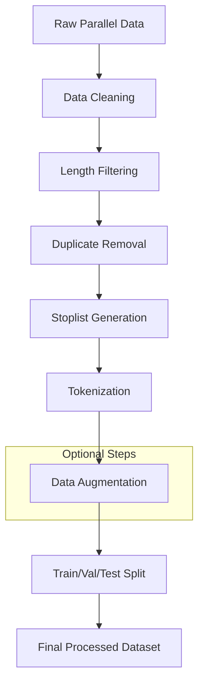

## 2. Data Cleaning Workflow

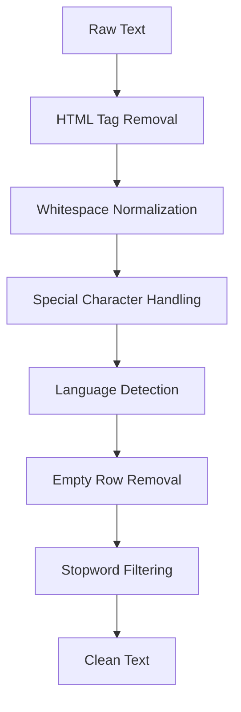

## 3. Tokenization Approaches

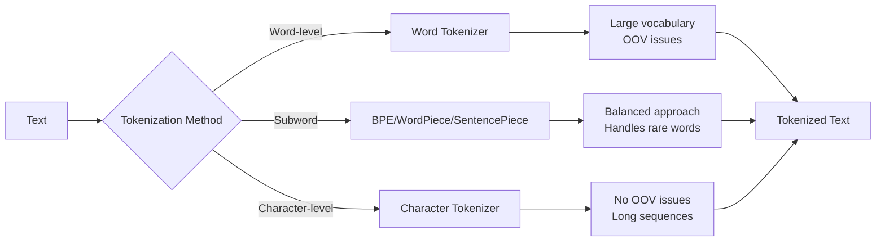

## 4. Data Augmentation Techniques

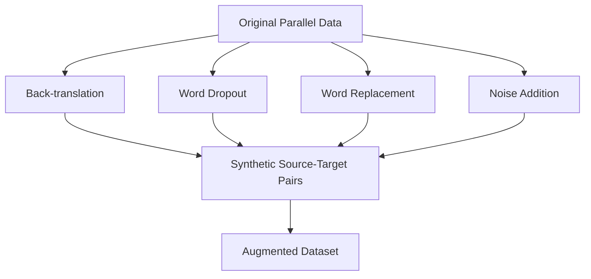

### Back-translation Process

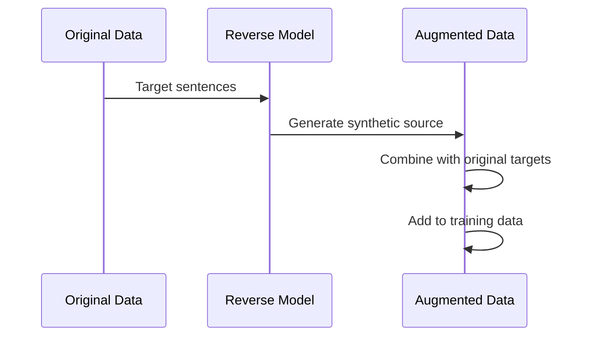

## 5. Low-Resource Language Strategies

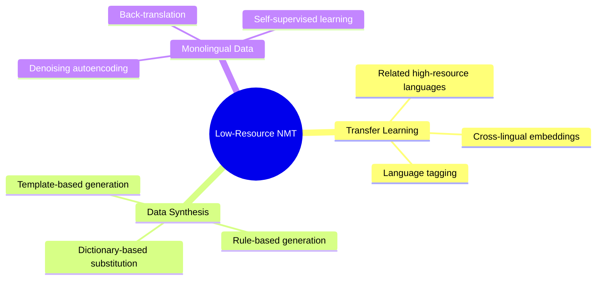

### Transfer Learning Workflow

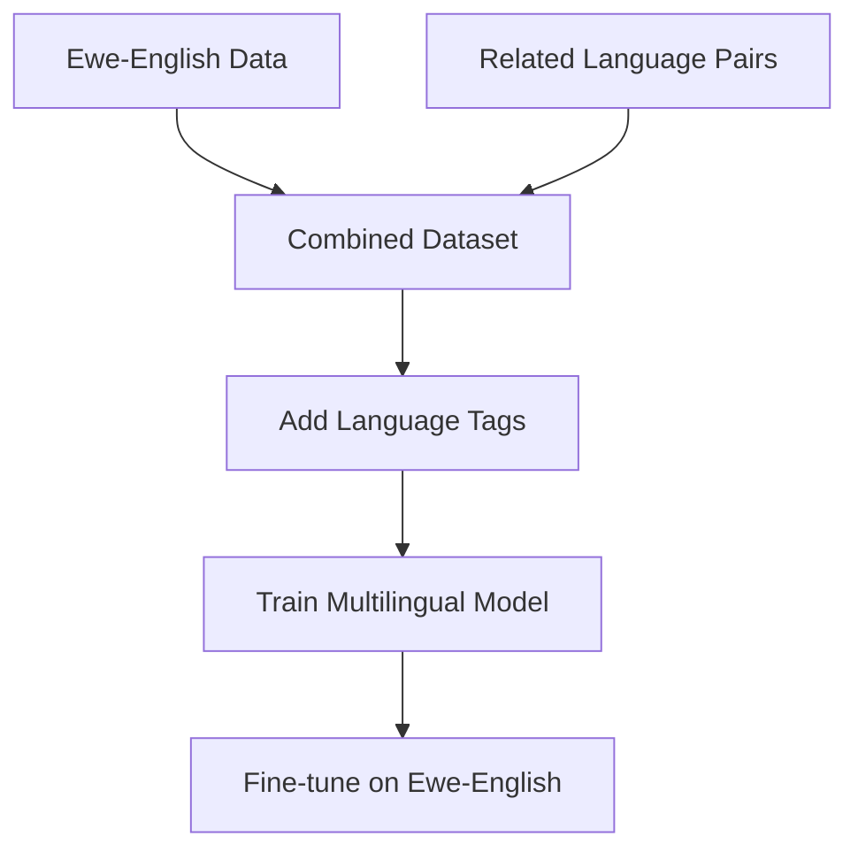

## 6. Stoplist Generation and Application

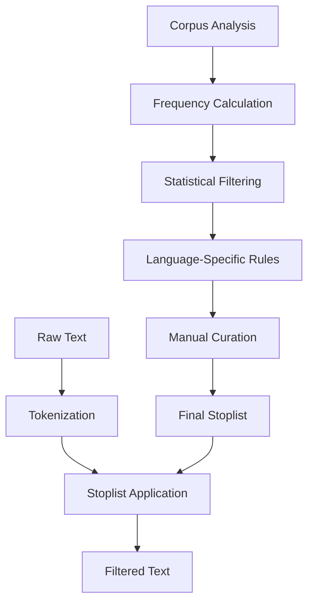

### Stoplist Generation Process

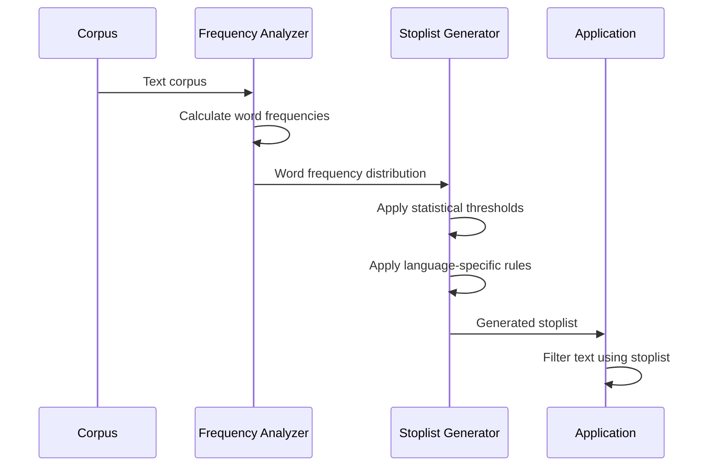

### Stoplist Comparison: Ewe vs. English

```mermaid
graph LR
    A[Stoplist Generation] --> B[English Stoplist]
    A --> C[Ewe Stoplist]
    
    B --> D[Common English stopwords:\nthe, a, an, of, in, etc.]
    C --> E[Ewe-specific stopwords:\nle, na, ɖe, la, etc.]
    
    D --> F[Application in Preprocessing]
    E --> F
```

### Impact of Stoplist on Translation Quality

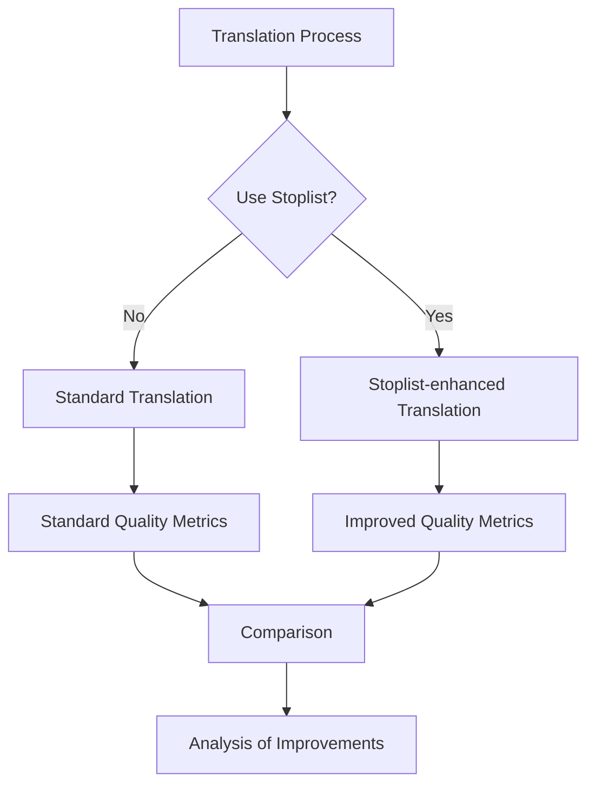
