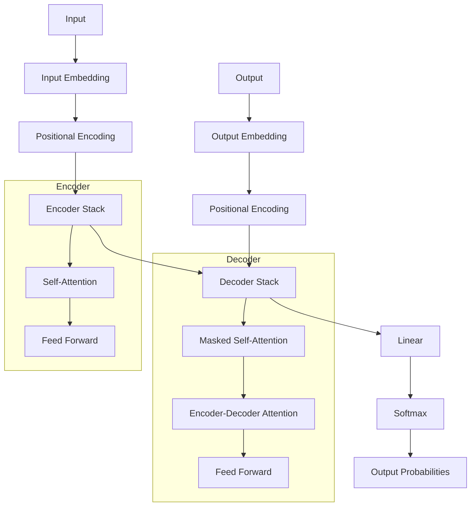

# Transformer Architecture

This page explains the transformer architecture used in the FoNu NLP TG project for Ewe-English translation.

## Overview

The transformer model is based on the architecture described in the paper ["Attention Is All You Need"](https://arxiv.org/abs/1706.03762) by Vaswani et al. (2017). It relies entirely on attention mechanisms, eliminating the need for recurrence and convolutions.

## Architecture Diagram



## Key Components

### 1. Embeddings

The first step is to convert input tokens into continuous vector representations:

```python
class Embeddings(nn.Module):
    def __init__(self, d_model, vocab):
        super(Embeddings, self).__init__()
        self.lut = nn.Embedding(vocab, d_model)
        self.d_model = d_model

    def forward(self, x):
        return self.lut(x) * math.sqrt(self.d_model)
```

### 2. Positional Encoding

Since the transformer doesn't use recurrence or convolution, we need to inject information about the position of tokens:

```python
class PositionalEncoding(nn.Module):
    def __init__(self, d_model, dropout, max_len=5000):
        super(PositionalEncoding, self).__init__()
        self.dropout = nn.Dropout(p=dropout)
        
        # Create positional encoding matrix
        pe = torch.zeros(max_len, d_model)
        position = torch.arange(0, max_len).unsqueeze(1)
        div_term = torch.exp(torch.arange(0, d_model, 2) * -(math.log(10000.0) / d_model))
        
        pe[:, 0::2] = torch.sin(position * div_term)
        pe[:, 1::2] = torch.cos(position * div_term)
        pe = pe.unsqueeze(0)
        
        self.register_buffer('pe', pe)
        
    def forward(self, x):
        x = x + self.pe[:, :x.size(1)]
        return self.dropout(x)
```

### 3. Multi-Head Attention

The core component of the transformer is the multi-head attention mechanism:

```python
class MultiHeadedAttention(nn.Module):
    def __init__(self, h, d_model, dropout=0.1):
        super(MultiHeadedAttention, self).__init__()
        assert d_model % h == 0
        
        self.d_k = d_model // h
        self.h = h
        
        self.linear_layers = clones(nn.Linear(d_model, d_model), 4)
        self.attn = None
        self.dropout = nn.Dropout(p=dropout)
        
    def forward(self, query, key, value, mask=None):
        if mask is not None:
            mask = mask.unsqueeze(1)
            
        nbatches = query.size(0)
        
        # Linear projections
        query, key, value = [
            l(x).view(nbatches, -1, self.h, self.d_k).transpose(1, 2)
            for l, x in zip(self.linear_layers, (query, key, value))
        ]
        
        # Apply attention
        x, self.attn = attention(query, key, value, mask=mask, dropout=self.dropout)
        
        # Concatenate heads and apply final linear layer
        x = x.transpose(1, 2).contiguous().view(nbatches, -1, self.h * self.d_k)
        
        return self.linear_layers[-1](x)
```

### 4. Feed-Forward Networks

Each layer in the encoder and decoder contains a fully connected feed-forward network:

```python
class PositionwiseFeedForward(nn.Module):
    def __init__(self, d_model, d_ff, dropout=0.1):
        super(PositionwiseFeedForward, self).__init__()
        self.w_1 = nn.Linear(d_model, d_ff)
        self.w_2 = nn.Linear(d_ff, d_model)
        self.dropout = nn.Dropout(p=dropout)
        
    def forward(self, x):
        return self.w_2(self.dropout(F.relu(self.w_1(x))))
```

### 5. Encoder and Decoder Layers

The encoder and decoder are composed of multiple layers:

```python
class EncoderLayer(nn.Module):
    def __init__(self, size, self_attn, feed_forward, dropout):
        super(EncoderLayer, self).__init__()
        self.self_attn = self_attn
        self.feed_forward = feed_forward
        self.sublayer = clones(SublayerConnection(size, dropout), 2)
        self.size = size
        
    def forward(self, x, mask):
        x = self.sublayer[0](x, lambda x: self.self_attn(x, x, x, mask))
        return self.sublayer[1](x, self.feed_forward)

class DecoderLayer(nn.Module):
    def __init__(self, size, self_attn, src_attn, feed_forward, dropout):
        super(DecoderLayer, self).__init__()
        self.size = size
        self.self_attn = self_attn
        self.src_attn = src_attn
        self.feed_forward = feed_forward
        self.sublayer = clones(SublayerConnection(size, dropout), 3)
        
    def forward(self, x, memory, src_mask, tgt_mask):
        x = self.sublayer[0](x, lambda x: self.self_attn(x, x, x, tgt_mask))
        x = self.sublayer[1](x, lambda x: self.src_attn(x, memory, memory, src_mask))
        return self.sublayer[2](x, self.feed_forward)
```

## Model Parameters

Our implementation uses the following parameters:

- **Vocabulary Size**: 8,000 tokens for both Ewe and English
- **Embedding Dimension**: 512
- **Number of Layers**: 6 for both encoder and decoder
- **Number of Attention Heads**: 8
- **Feed-Forward Dimension**: 2048
- **Dropout Rate**: 0.1

## Training Configuration

The model is trained with the following configuration:

- **Optimizer**: Adam with β₁ = 0.9, β₂ = 0.98, ε = 10⁻⁹
- **Learning Rate Schedule**: Custom schedule with warmup
- **Batch Size**: 32 sentence pairs
- **Label Smoothing**: 0.1
- **Maximum Sequence Length**: 100 tokens

## Inference Process

During inference, we use the following process:

1. Encode the source sentence
2. Initialize the target with a start token
3. Generate tokens one by one using the decoder
4. Stop when an end token is generated or maximum length is reached

## Attention Visualization

The attention patterns in the model can be visualized to understand how the model translates between Ewe and English:


## References

1. Vaswani, A., Shazeer, N., Parmar, N., Uszkoreit, J., Jones, L., Gomez, A. N., ... & Polosukhin, I. (2017). Attention is all you need. In Advances in neural information processing systems (pp. 5998-6008).

2. Klein, G., Kim, Y., Deng, Y., Senellart, J., & Rush, A. M. (2017). OpenNMT: Open-source toolkit for neural machine translation. arXiv preprint arXiv:1701.02810.
